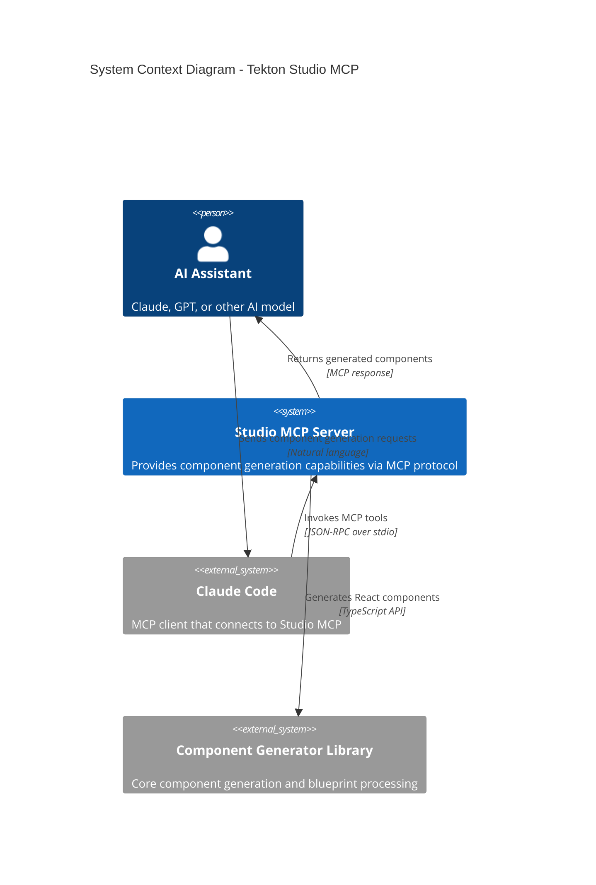
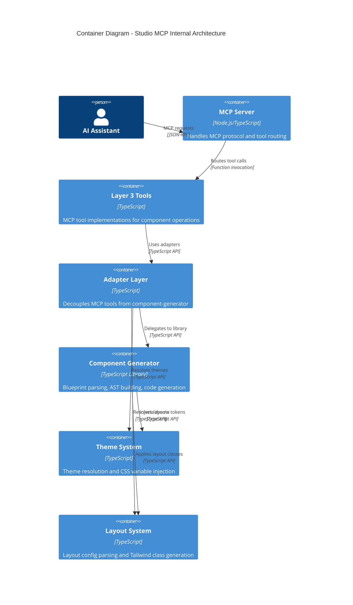
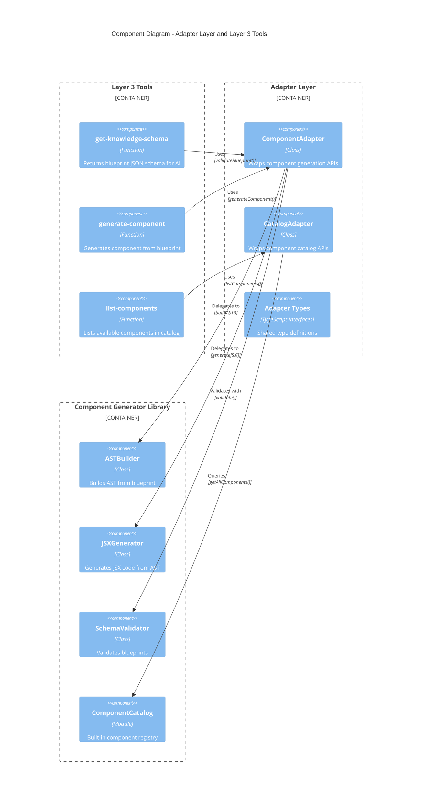
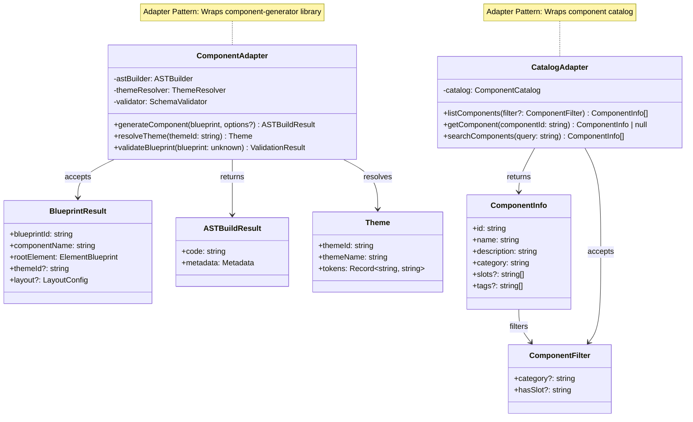
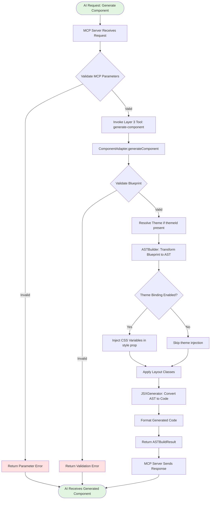
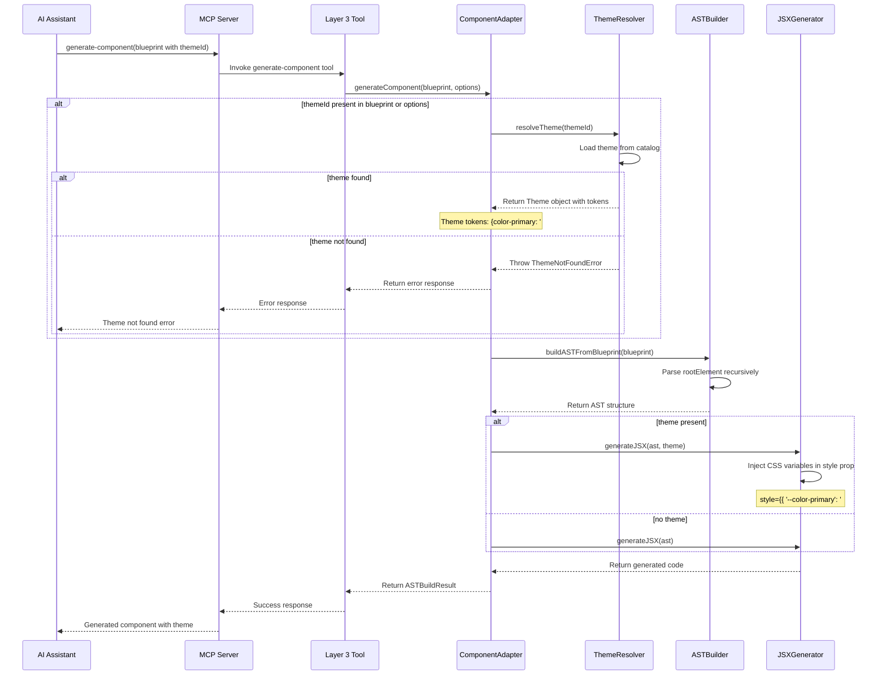
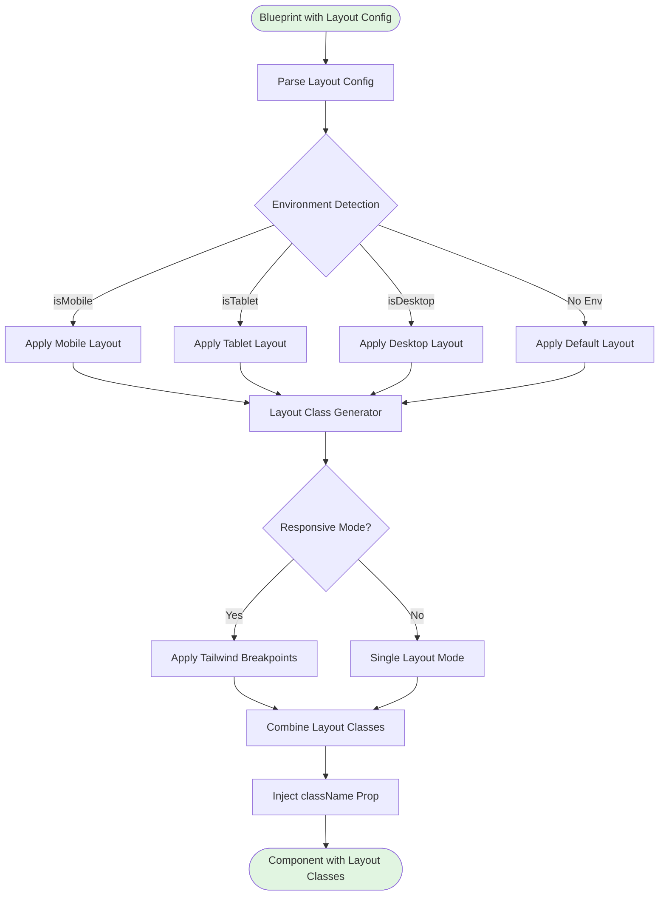
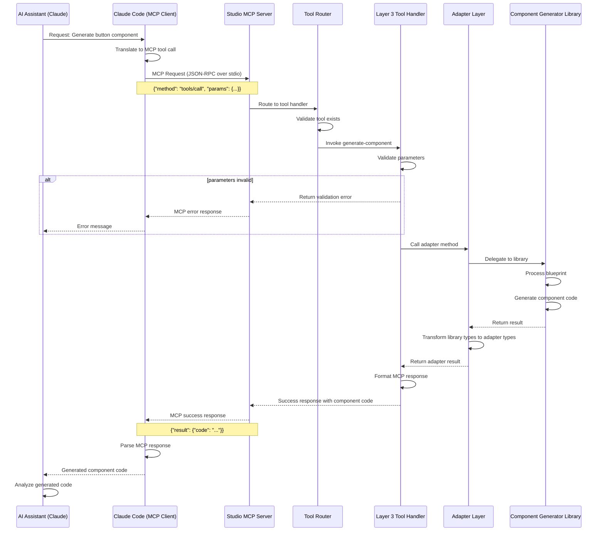
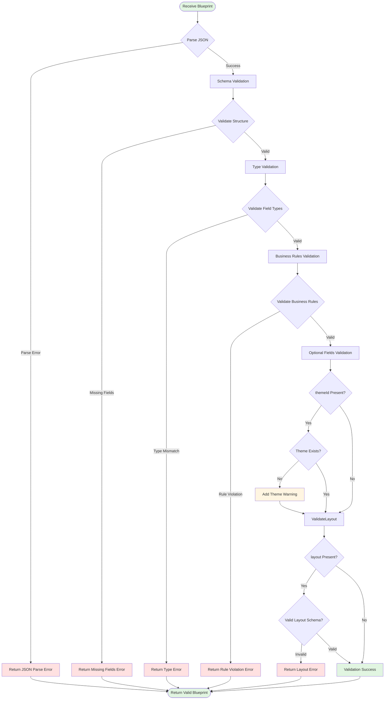
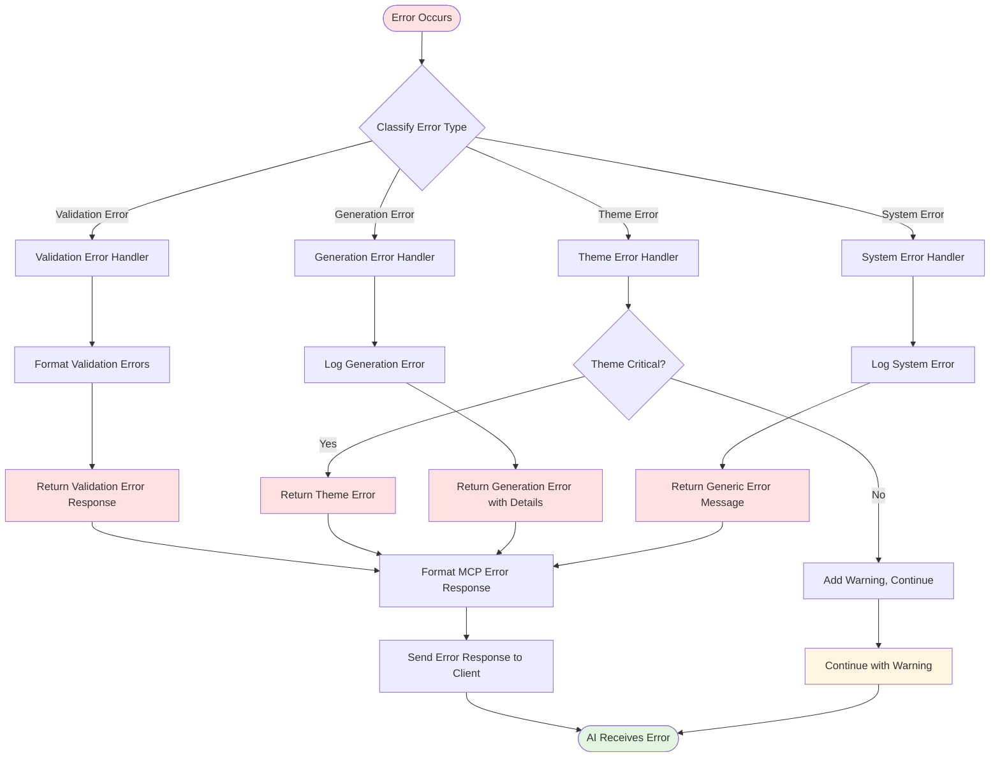

# Architecture Diagrams

**Generated:** 2026-01-23
**Purpose:** Visual documentation of Tekton Studio MCP system architecture
**Diagram Tool:** Mermaid 11.x

---

## Table of Contents

1. [System Context Diagram (C4 Level 1)](#system-context-diagram-c4-level-1)
2. [Container Diagram (C4 Level 2)](#container-diagram-c4-level-2)
3. [Component Diagram (C4 Level 3)](#component-diagram-c4-level-3)
4. [Adapter Pattern Structure](#adapter-pattern-structure)
5. [Component Generator Flow](#component-generator-flow)
6. [Theme Binding Sequence](#theme-binding-sequence)
7. [Layout Management Flow](#layout-management-flow)
8. [MCP Tool Interaction Sequence](#mcp-tool-interaction-sequence)
9. [Blueprint Validation Process](#blueprint-validation-process)
10. [Error Handling Flow](#error-handling-flow)

---

## System Context Diagram (C4 Level 1)

**Purpose:** Shows high-level system interactions and external dependencies.



**Key External Systems:**
- **Claude Code**: MCP client that orchestrates AI workflows
- **Component Generator Library**: Shared library for blueprint processing
- **AI Assistant**: End user (Claude, GPT, or other AI models)

---

## Container Diagram (C4 Level 2)

**Purpose:** Shows main containers and their relationships within the system.



**Container Responsibilities:**

| Container | Responsibility | Technology |
|-----------|---------------|------------|
| MCP Server | Protocol handling, tool registration | Node.js + MCP SDK |
| Layer 3 Tools | Tool implementations, request validation | TypeScript |
| Adapter Layer | API abstraction, type transformation | TypeScript |
| Component Generator | Blueprint → AST → Code generation | TypeScript |
| Theme System | Theme resolution, token injection | TypeScript |
| Layout System | Layout parsing, Tailwind class gen | TypeScript |

---

## Component Diagram (C4 Level 3)

**Purpose:** Detailed view of key components within the Adapter Layer and Layer 3 Tools.



**Component Responsibilities:**

**Layer 3 Tools:**
- `get-knowledge-schema`: Provides JSON schema and examples for AI assistants
- `generate-component`: Orchestrates component generation workflow
- `list-components`: Returns searchable component catalog

**Adapter Layer:**
- `ComponentAdapter`: Wraps component generation, theme resolution, validation
- `CatalogAdapter`: Wraps component listing, searching, filtering
- `Adapter Types`: Shared interfaces (ComponentInfo, ComponentFilter)

**Component Generator:**
- `ASTBuilder`: Transforms blueprint JSON to AST representation
- `JSXGenerator`: Converts AST to executable JSX code
- `SchemaValidator`: Validates blueprint against JSON schema
- `ComponentCatalog`: Registry of built-in component blueprints

---

## Adapter Pattern Structure

**Purpose:** Shows adapter pattern relationships and data flow.



**Pattern Benefits:**
1. **Decoupling**: MCP tools don't depend on component-generator implementation
2. **Type Safety**: Adapters provide stable, well-typed interfaces
3. **Flexibility**: Easy to swap component-generator implementations
4. **Testability**: Adapters can be mocked for unit testing

---

## Component Generator Flow

**Purpose:** End-to-end component generation process.



**Key Decision Points:**
1. **MCP Parameter Validation**: Ensures request structure is valid
2. **Blueprint Validation**: Validates against JSON schema
3. **Theme Binding**: Optional CSS variable injection
4. **Layout Application**: Optional Tailwind class injection

**Error Handling:**
- Invalid parameters → Return error immediately
- Invalid blueprint → Return validation errors with details
- Theme not found → Continue without theme (optional feature)

---

## Theme Binding Sequence

**Purpose:** Detailed sequence of theme resolution and injection process.



**Theme Resolution Steps:**
1. Extract `themeId` from blueprint or options
2. Query theme catalog with theme ID
3. Retrieve theme tokens (color, typography, spacing)
4. Inject tokens as CSS variables in component's `style` prop

**CSS Variable Injection Example:**
```typescript
// Without theme
<button>Click me</button>

// With theme (minimal-theme)
<button style={{
  '--color-primary': '#007bff',
  '--color-secondary': '#6c757d',
  '--font-family': 'Inter, sans-serif'
}}>
  Click me
</button>
```

---

## Layout Management Flow

**Purpose:** Layout configuration parsing and Tailwind class generation.



**Layout Class Generation Example:**

**Input (Blueprint with Layout):**
```json
{
  "blueprintId": "btn-001",
  "componentName": "ResponsiveButton",
  "layout": {
    "mode": "responsive",
    "mobile": { "width": "full", "padding": "sm" },
    "tablet": { "width": "auto", "padding": "md" },
    "desktop": { "width": "auto", "padding": "lg" }
  },
  "rootElement": {
    "tag": "button",
    "children": [{ "type": "text", "value": "Click me" }]
  }
}
```

**Output (Generated Classes):**
```typescript
<button className="w-full p-2 sm:w-auto sm:p-4 lg:w-auto lg:p-6">
  Click me
</button>
```

**Tailwind Breakpoints:**
- Mobile (default): `w-full p-2`
- Tablet (sm): `sm:w-auto sm:p-4`
- Desktop (lg): `lg:w-auto lg:p-6`

---

## MCP Tool Interaction Sequence

**Purpose:** Complete MCP tool invocation flow from AI request to response.



**MCP Tool Registry:**
1. `get-knowledge-schema`: Returns blueprint JSON schema
2. `generate-component`: Generates component from blueprint
3. `list-components`: Lists available components in catalog

**Protocol Details:**
- **Transport:** stdio (standard input/output)
- **Format:** JSON-RPC 2.0
- **Message Structure:**
  - Request: `{ jsonrpc, method, params, id }`
  - Response: `{ jsonrpc, result, id }` or `{ jsonrpc, error, id }`

---

## Blueprint Validation Process

**Purpose:** Multi-stage blueprint validation flow.



**Validation Stages:**

**Stage 1: JSON Parsing**
- Validate JSON syntax
- Check for malformed JSON
- Return parse error if invalid

**Stage 2: Schema Validation**
- Validate against Zod schema (`BlueprintResultSchema`)
- Check required fields: `blueprintId`, `componentName`, `rootElement`
- Validate field types (string, object, array)

**Stage 3: Type Validation**
- Validate `rootElement` structure
- Check element tag names (valid HTML tags)
- Validate children structure (text, element)

**Stage 4: Business Rules**
- Unique blueprint ID
- Valid component name (PascalCase)
- No circular element references
- Maximum nesting depth (10 levels)

**Stage 5: Optional Fields**
- Validate `themeId` if present (warning if not found)
- Validate `layout` if present (schema validation)
- Validate `environment` if present

**Validation Error Format:**
```typescript
{
  valid: false,
  errors: [
    {
      field: 'rootElement.tag',
      message: 'Invalid HTML tag: "invalid-tag"',
      code: 'INVALID_TAG'
    }
  ]
}
```

---

## Error Handling Flow

**Purpose:** Comprehensive error handling strategy across all layers.



**Error Categories:**

**1. Validation Errors (User-Facing)**
- Caused by invalid blueprint structure
- Examples: Missing fields, invalid types, rule violations
- Response: Detailed error messages with field names and suggestions
- Recovery: User fixes blueprint and retries

**2. Theme Errors (Optional Feature)**
- Caused by missing or invalid theme ID
- Examples: Theme not found, theme load failure
- Response: Warning or error depending on criticality
- Recovery: Continue without theme (warning) or fail (error)

**3. Generation Errors (Internal)**
- Caused by failures in code generation process
- Examples: AST build failure, JSX generation failure
- Response: Error message with internal details
- Recovery: Log error, return generic message to user

**4. System Errors (Critical)**
- Caused by unexpected system failures
- Examples: File system errors, memory errors, crashes
- Response: Generic error message (hide internal details)
- Recovery: Log full error, alert developers, return safe message

**Error Response Format:**
```typescript
{
  success: false,
  error: {
    code: 'VALIDATION_ERROR',
    message: 'Blueprint validation failed',
    details: [
      {
        field: 'rootElement.tag',
        message: 'Invalid HTML tag',
        suggestion: 'Use valid HTML5 tag (div, button, etc.)'
      }
    ]
  }
}
```

**Error Handling Best Practices:**
1. **Classify errors early**: Determine error type as soon as possible
2. **Provide context**: Include field names, values, and suggestions
3. **Fail fast**: Return errors immediately when detected
4. **Log everything**: Log all errors for debugging and monitoring
5. **User-friendly messages**: Translate internal errors to actionable messages
6. **Avoid leaking internals**: Hide implementation details in system errors

---

## Diagram Usage Guide

### How to Read These Diagrams

**C4 Diagrams (Context, Container, Component):**
- Read from top to bottom, outside to inside
- Start with external actors (users, systems)
- Follow relationships to understand interactions
- Blue boxes: Internal systems/components
- Gray boxes: External systems

**Flowcharts:**
- Follow arrows from start to end
- Diamond shapes: Decision points
- Rectangle shapes: Process steps
- Green backgrounds: Start/success states
- Red backgrounds: Error states
- Yellow backgrounds: Warning states

**Sequence Diagrams:**
- Read from top to bottom
- Participants shown at top
- Solid arrows: Requests
- Dashed arrows: Responses
- Notes: Additional context
- Alt/Opt blocks: Conditional flows

**Class Diagrams:**
- Boxes represent classes/interfaces
- Arrows show relationships
- `+` prefix: Public methods/properties
- `-` prefix: Private methods/properties
- `~` symbol: Generic types

### Updating These Diagrams

**When to Update:**
1. New components added to system
2. Architecture changes (new layers, patterns)
3. API changes (new parameters, methods)
4. New error handling paths
5. New integrations or external systems

**How to Update:**
1. Edit Mermaid syntax in this markdown file
2. Test rendering with Mermaid Live Editor (https://mermaid.live)
3. Ensure diagram remains readable (not too complex)
4. Update description text if needed
5. Commit changes with descriptive message

**Best Practices:**
- Keep diagrams focused (one concept per diagram)
- Use consistent naming across diagrams
- Add notes for complex interactions
- Update related documentation when changing diagrams
- Test rendering before committing

---

## Related Documentation

**Internal Documentation:**
- [Implementation State Report](implementation-state-2026-01-23.md) - Current system state
- [Adapter Pattern Guide](adapter-pattern-guide.md) - Adapter implementation details
- [API Changes Guide](api-changes-preset-to-theme.md) - API migration documentation
- [Test Coverage Report](test-coverage-report.md) - Test coverage analysis

**External Resources:**
- [C4 Model Documentation](https://c4model.com/) - C4 diagramming approach
- [Mermaid Documentation](https://mermaid.js.org/) - Mermaid syntax reference
- [UML Sequence Diagrams](https://www.uml-diagrams.org/sequence-diagrams.html) - Sequence diagram guide

---

**Document Metadata:**
- **Generated:** 2026-01-23
- **Diagrams:** 10 total (C4, sequence, flowchart, class)
- **Diagram Tool:** Mermaid 11.x
- **Maintained by:** workflow-docs agent
- **Version:** 1.0.0

---

**End of Architecture Diagrams**
