# Curated Themes Architecture

## Overview

**Purpose**: Systematic theme management system replacing the deprecated Brand DNA architecture with modern, extensible, and MCP-powered theme recommendations.

**Status**: Production Ready (Phase 1-2 Complete)
**Coverage**: 85.23% test coverage
**Version**: 1.0.0
**Last Updated**: 2026-01-15

---

## System Architecture

### High-Level Architecture

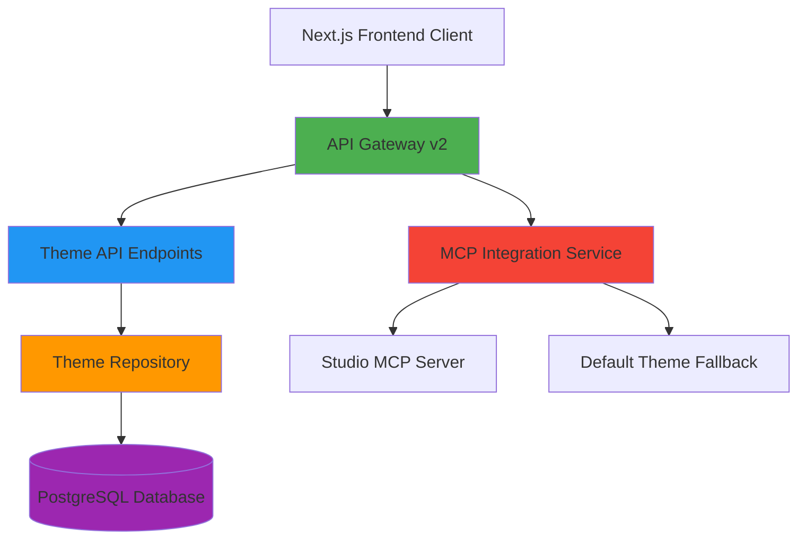
```mermaid
graph TD
    Client[Next.js Frontend Client] --> Gateway[API Gateway v2]
    Gateway --> PresetAPI[Theme API Endpoints]
    Gateway --> MCPService[MCP Integration Service]
    PresetAPI --> Repository[Theme Repository]
    Repository --> Database[(PostgreSQL Database)]
    MCPService --> MCPServer[Studio MCP Server]
    MCPService --> Fallback[Default Theme Fallback]

    style Gateway fill:#4CAF50
    style PresetAPI fill:#2196F3
    style Repository fill:#FF9800
    style Database fill:#9C27B0
    style MCPService fill:#F44336
```

### Component Layers

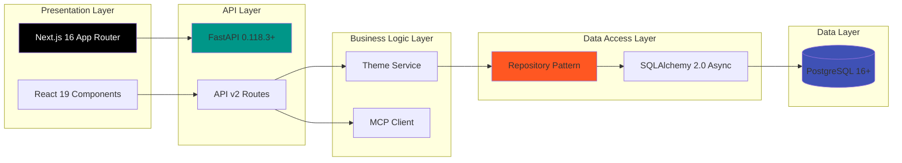
```mermaid
graph LR
    subgraph "Presentation Layer"
        NextJS[Next.js 16 App Router]
        React[React 19 Components]
    end

    subgraph "API Layer"
        FastAPI[FastAPI 0.118.3+]
        APIv2[API v2 Routes]
    end

    subgraph "Business Logic Layer"
        PresetService[Theme Service]
        MCPClient[MCP Client]
    end

    subgraph "Data Access Layer"
        Repository[Repository Pattern]
        SQLAlchemy[SQLAlchemy 2.0 Async]
    end

    subgraph "Data Layer"
        PostgreSQL[(PostgreSQL 16+)]
    end

    NextJS --> FastAPI
    React --> APIv2
    APIv2 --> PresetService
    APIv2 --> MCPClient
    PresetService --> Repository
    Repository --> SQLAlchemy
    SQLAlchemy --> PostgreSQL

    style NextJS fill:#000000,color:#ffffff
    style FastAPI fill:#009688
    style Repository fill:#FF5722
    style PostgreSQL fill:#3F51B5
```

---

## Database Schema

### Curated Themes Table

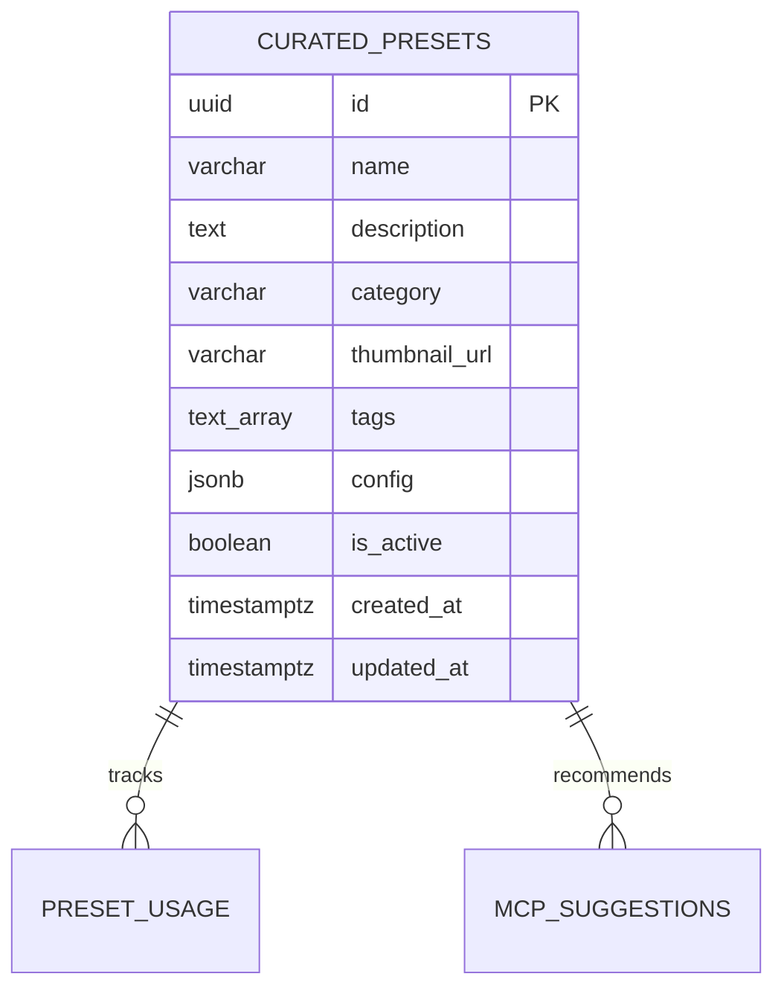
```mermaid
erDiagram
    CURATED_PRESETS {
        uuid id PK
        varchar name
        text description
        varchar category
        varchar thumbnail_url
        text_array tags
        jsonb config
        boolean is_active
        timestamptz created_at
        timestamptz updated_at
    }

    CURATED_PRESETS ||--o{ PRESET_USAGE : "tracks"
    CURATED_PRESETS ||--o{ MCP_SUGGESTIONS : "recommends"
```

### Schema Details

**Primary Table**: `curated_presets`

| Column | Type | Constraints | Description |
|--------|------|-------------|-------------|
| `id` | UUID | PRIMARY KEY | Unique theme identifier |
| `name` | VARCHAR(255) | NOT NULL | Theme display name |
| `description` | TEXT | NULLABLE | Detailed theme description |
| `category` | VARCHAR(100) | NULLABLE | Theme category for filtering |
| `thumbnail_url` | VARCHAR(500) | NULLABLE | Preview image URL |
| `tags` | TEXT[] | DEFAULT '{}' | Searchable tags array |
| `config` | JSONB | DEFAULT '{}' | Extensible theme configuration |
| `is_active` | BOOLEAN | DEFAULT true | Soft delete flag |
| `created_at` | TIMESTAMPTZ | DEFAULT CURRENT_TIMESTAMP | Creation timestamp |
| `updated_at` | TIMESTAMPTZ | DEFAULT CURRENT_TIMESTAMP | Last update timestamp |

**Indexes**:
- `idx_curated_presets_category` - B-tree index on `category` for filtering
- `idx_curated_presets_name` - B-tree index on `name` for search
- `idx_curated_presets_is_active` - B-tree index on `is_active` for active theme queries
- `idx_curated_presets_tags` - GIN index on `tags` for array searching

**Performance Considerations**:
- JSONB `config` field allows flexible metadata without schema changes
- GIN index on `tags` enables efficient array element searching
- `is_active` index optimizes soft delete queries
- `updated_at` automatically updated via trigger

---

## API Architecture

### API Versioning Strategy

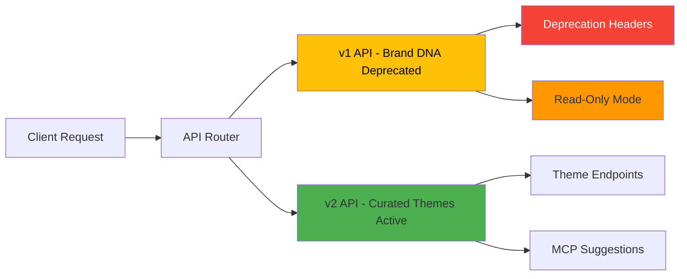
```mermaid
graph LR
    Client[Client Request] --> Router[API Router]
    Router --> v1[v1 API - Brand DNA Deprecated]
    Router --> v2[v2 API - Curated Themes Active]

    v1 --> Deprecation[Deprecation Headers]
    v1 --> ReadOnly[Read-Only Mode]

    v2 --> PresetEndpoints[Theme Endpoints]
    v2 --> MCPEndpoints[MCP Suggestions]

    style v1 fill:#FFC107,color:#000000
    style v2 fill:#4CAF50
    style Deprecation fill:#F44336,color:#ffffff
    style ReadOnly fill:#FF9800
```

### API Endpoints

#### Theme Management

**List Themes**: `GET /api/v2/themes`

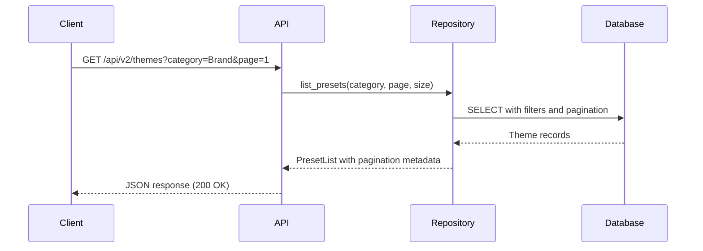
```mermaid
sequenceDiagram
    participant Client
    participant API
    participant Repository
    participant Database

    Client->>API: GET /api/v2/themes?category=Brand&page=1
    API->>Repository: list_presets(category, page, size)
    Repository->>Database: SELECT with filters and pagination
    Database-->>Repository: Theme records
    Repository-->>API: PresetList with pagination metadata
    API-->>Client: JSON response (200 OK)
```

**Get Theme**: `GET /api/v2/themes/{id}`

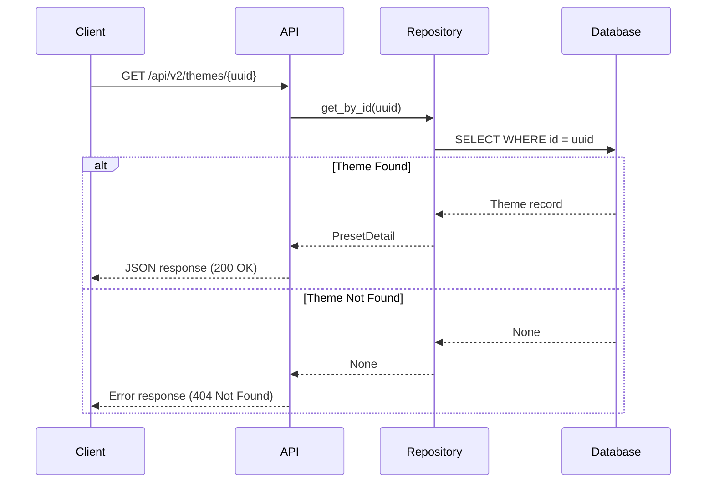
```mermaid
sequenceDiagram
    participant Client
    participant API
    participant Repository
    participant Database

    Client->>API: GET /api/v2/themes/{uuid}
    API->>Repository: get_by_id(uuid)
    Repository->>Database: SELECT WHERE id = uuid

    alt Theme Found
        Database-->>Repository: Theme record
        Repository-->>API: PresetDetail
        API-->>Client: JSON response (200 OK)
    else Theme Not Found
        Database-->>Repository: None
        Repository-->>API: None
        API-->>Client: Error response (404 Not Found)
    end
```

**MCP Suggestions**: `GET /api/v2/themes/suggestions`

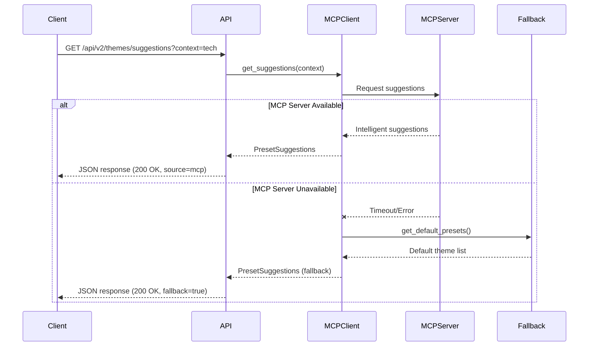
```mermaid
sequenceDiagram
    participant Client
    participant API
    participant MCPClient
    participant MCPServer
    participant Fallback

    Client->>API: GET /api/v2/themes/suggestions?context=tech
    API->>MCPClient: get_suggestions(context)
    MCPClient->>MCPServer: Request suggestions

    alt MCP Server Available
        MCPServer-->>MCPClient: Intelligent suggestions
        MCPClient-->>API: PresetSuggestions
        API-->>Client: JSON response (200 OK, source=mcp)
    else MCP Server Unavailable
        MCPServer--xMCPClient: Timeout/Error
        MCPClient->>Fallback: get_default_presets()
        Fallback-->>MCPClient: Default theme list
        MCPClient-->>API: PresetSuggestions (fallback)
        API-->>Client: JSON response (200 OK, fallback=true)
    end
```

---

## Data Flow Architecture

### Theme Retrieval Flow

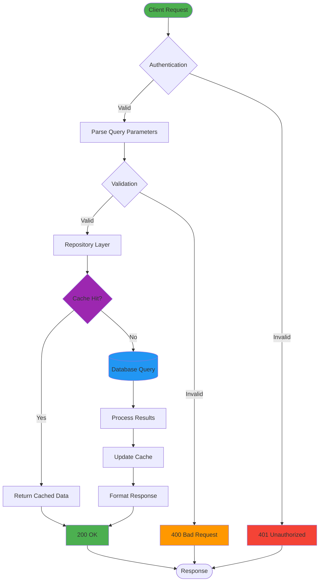
```mermaid
flowchart TD
    Start([Client Request]) --> Auth{Authentication}
    Auth -->|Valid| Parse[Parse Query Parameters]
    Auth -->|Invalid| Error401[401 Unauthorized]

    Parse --> Validate{Validation}
    Validate -->|Valid| Repository[Repository Layer]
    Validate -->|Invalid| Error400[400 Bad Request]

    Repository --> Cache{Cache Hit?}
    Cache -->|Yes| CacheResponse[Return Cached Data]
    Cache -->|No| Database[(Database Query)]

    Database --> Process[Process Results]
    Process --> CacheStore[Update Cache]
    CacheStore --> Response[Format Response]

    Response --> Success[200 OK]
    CacheResponse --> Success

    Error400 --> End([Response])
    Error401 --> End
    Success --> End

    style Start fill:#4CAF50
    style Success fill:#4CAF50
    style Error400 fill:#FF9800
    style Error401 fill:#F44336
    style Database fill:#2196F3
    style Cache fill:#9C27B0
```

### MCP Integration Flow

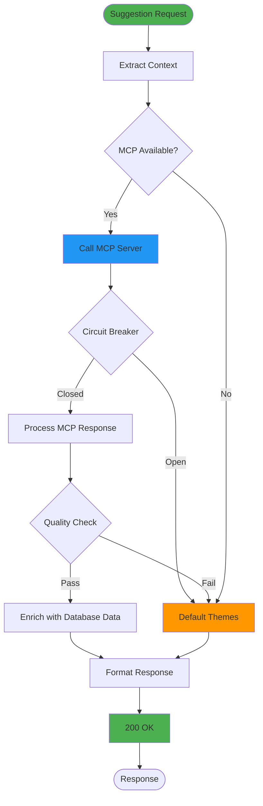
```mermaid
flowchart TD
    Start([Suggestion Request]) --> Context[Extract Context]
    Context --> MCPRequest{MCP Available?}

    MCPRequest -->|Yes| CallMCP[Call MCP Server]
    CallMCP --> CircuitBreaker{Circuit Breaker}

    CircuitBreaker -->|Open| Fallback[Default Themes]
    CircuitBreaker -->|Closed| ProcessMCP[Process MCP Response]

    ProcessMCP --> Quality{Quality Check}
    Quality -->|Pass| EnrichData[Enrich with Database Data]
    Quality -->|Fail| Fallback

    MCPRequest -->|No| Fallback

    EnrichData --> Response[Format Response]
    Fallback --> Response

    Response --> Success[200 OK]
    Success --> End([Response])

    style Start fill:#4CAF50
    style CallMCP fill:#2196F3
    style Fallback fill:#FF9800
    style Success fill:#4CAF50
```

---

## Integration Patterns

### MCP Circuit Breaker Pattern

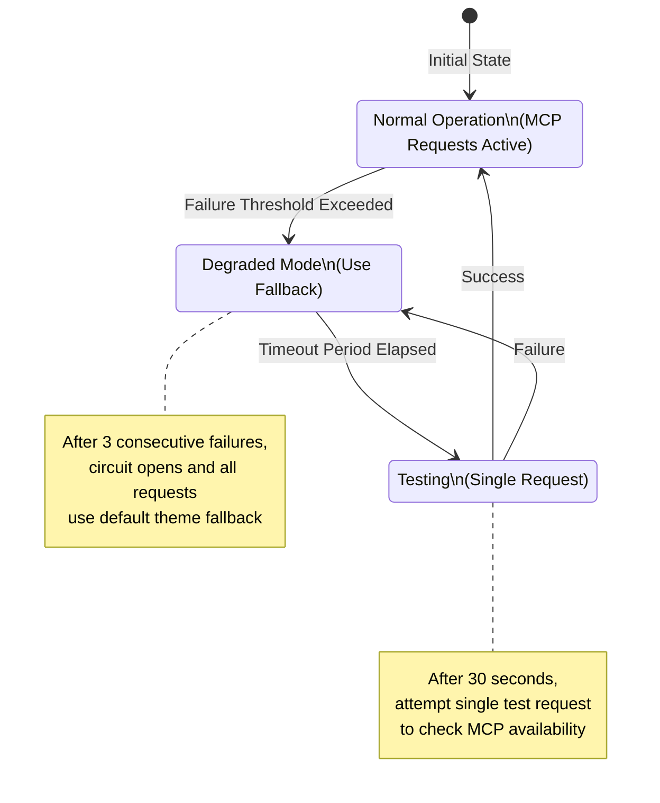
```mermaid
stateDiagram-v2
    [*] --> Closed: Initial State

    Closed --> Open: Failure Threshold Exceeded
    Open --> HalfOpen: Timeout Period Elapsed
    HalfOpen --> Closed: Success
    HalfOpen --> Open: Failure

    Closed: Normal Operation\n(MCP Requests Active)
    Open: Degraded Mode\n(Use Fallback)
    HalfOpen: Testing\n(Single Request)

    note right of Open
        After 3 consecutive failures,
        circuit opens and all requests
        use default theme fallback
    end note

    note right of HalfOpen
        After 30 seconds,
        attempt single test request
        to check MCP availability
    end note
```

### Database Transaction Pattern

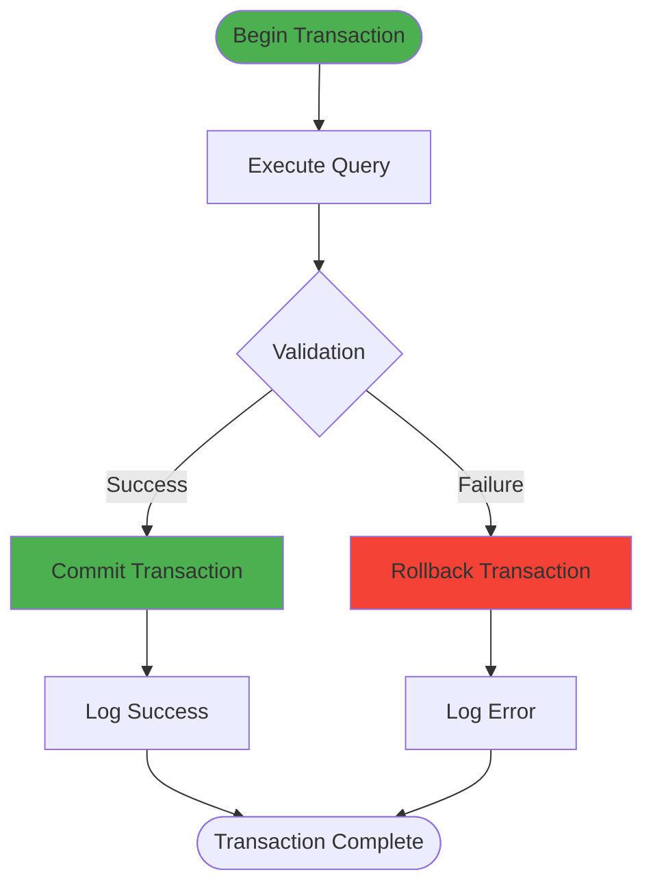
```mermaid
flowchart TD
    Start([Begin Transaction]) --> Query[Execute Query]
    Query --> Validate{Validation}

    Validate -->|Success| Commit[Commit Transaction]
    Validate -->|Failure| Rollback[Rollback Transaction]

    Commit --> Log[Log Success]
    Rollback --> LogError[Log Error]

    Log --> End([Transaction Complete])
    LogError --> End

    style Start fill:#4CAF50
    style Commit fill:#4CAF50
    style Rollback fill:#F44336
```

---

## Performance Optimization

### Caching Strategy

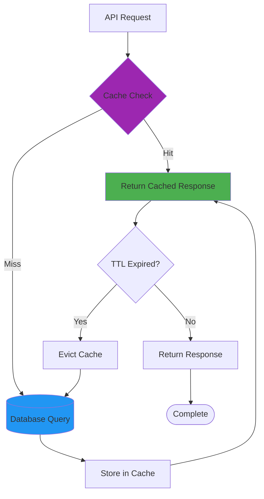
```mermaid
graph TD
    Request[API Request] --> CacheCheck{Cache Check}

    CacheCheck -->|Hit| CacheReturn[Return Cached Response]
    CacheCheck -->|Miss| Database[(Database Query)]

    Database --> CacheStore[Store in Cache]
    CacheStore --> CacheReturn

    CacheReturn --> TTL{TTL Expired?}
    TTL -->|No| Response[Return Response]
    TTL -->|Yes| Evict[Evict Cache]
    Evict --> Database

    Response --> End([Complete])

    style CacheCheck fill:#9C27B0
    style CacheReturn fill:#4CAF50
    style Database fill:#2196F3
```

**Cache Configuration**:
- **Theme List Cache**: TTL 5 minutes, max 1000 items
- **Theme Detail Cache**: TTL 10 minutes, max 500 items
- **Category List Cache**: TTL 30 minutes, max 100 items
- **MCP Suggestion Cache**: TTL 2 minutes, max 200 items

### Query Optimization

**Index Usage**:
```sql
-- Category filtering (uses idx_curated_presets_category)
SELECT * FROM curated_presets WHERE category = 'Brand';

-- Name search (uses idx_curated_presets_name)
SELECT * FROM curated_presets WHERE name ILIKE '%Tech%';

-- Tag filtering (uses idx_curated_presets_tags GIN index)
SELECT * FROM curated_presets WHERE tags @> ARRAY['startup'];

-- Active themes (uses idx_curated_presets_is_active)
SELECT * FROM curated_presets WHERE is_active = true;
```

**Pagination Strategy**:
```sql
-- Efficient pagination with LIMIT/OFFSET
SELECT * FROM curated_presets
WHERE is_active = true
ORDER BY created_at DESC
LIMIT 20 OFFSET 40;  -- Page 3, size 20
```

---

## Security Architecture

### Authentication Flow

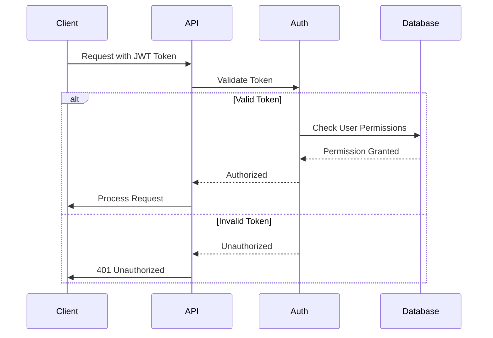
```mermaid
sequenceDiagram
    participant Client
    participant API
    participant Auth
    participant Database

    Client->>API: Request with JWT Token
    API->>Auth: Validate Token

    alt Valid Token
        Auth->>Database: Check User Permissions
        Database-->>Auth: Permission Granted
        Auth-->>API: Authorized
        API->>Client: Process Request
    else Invalid Token
        Auth-->>API: Unauthorized
        API->>Client: 401 Unauthorized
    end
```

### Data Validation Layers

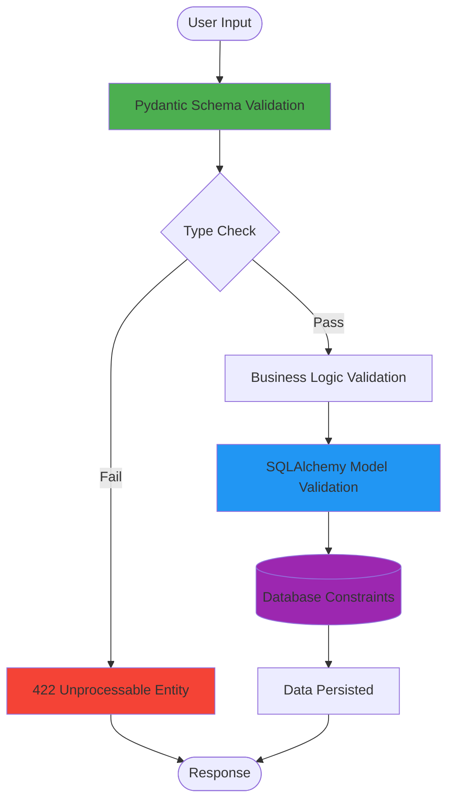
```mermaid
flowchart TD
    Input([User Input]) --> Pydantic[Pydantic Schema Validation]
    Pydantic --> TypeCheck{Type Check}

    TypeCheck -->|Pass| Business[Business Logic Validation]
    TypeCheck -->|Fail| Error422[422 Unprocessable Entity]

    Business --> SQLAlchemy[SQLAlchemy Model Validation]
    SQLAlchemy --> Database[(Database Constraints)]

    Database --> Success[Data Persisted]
    Error422 --> End([Response])
    Success --> End

    style Pydantic fill:#4CAF50
    style SQLAlchemy fill:#2196F3
    style Database fill:#9C27B0
    style Error422 fill:#F44336
```

---

## Deployment Architecture

### Production Environment

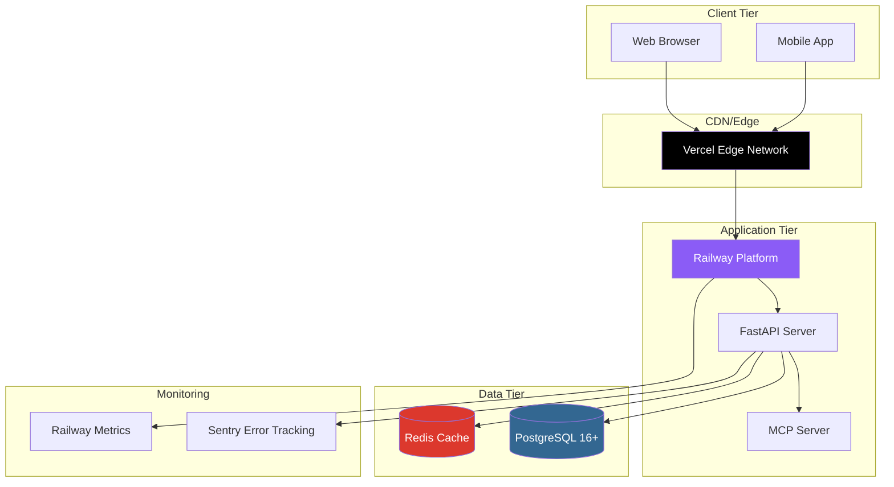
```mermaid
graph TD
    subgraph "Client Tier"
        Browser[Web Browser]
        Mobile[Mobile App]
    end

    subgraph "CDN/Edge"
        Vercel[Vercel Edge Network]
    end

    subgraph "Application Tier"
        Railway[Railway Platform]
        APIServer[FastAPI Server]
        MCPServer[MCP Server]
    end

    subgraph "Data Tier"
        PostgreSQL[(PostgreSQL 16+)]
        Redis[(Redis Cache)]
    end

    subgraph "Monitoring"
        Sentry[Sentry Error Tracking]
        Metrics[Railway Metrics]
    end

    Browser --> Vercel
    Mobile --> Vercel
    Vercel --> Railway
    Railway --> APIServer
    APIServer --> MCPServer
    APIServer --> PostgreSQL
    APIServer --> Redis
    APIServer --> Sentry
    Railway --> Metrics

    style Vercel fill:#000000,color:#ffffff
    style Railway fill:#8B5CF6,color:#ffffff
    style PostgreSQL fill:#336791,color:#ffffff
    style Redis fill:#DC382D,color:#ffffff
```

### Scaling Strategy

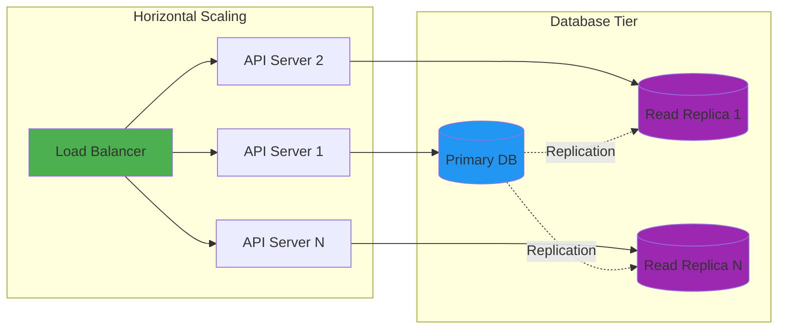
```mermaid
graph LR
    subgraph "Horizontal Scaling"
        LB[Load Balancer]
        API1[API Server 1]
        API2[API Server 2]
        API3[API Server N]
    end

    subgraph "Database Tier"
        Primary[(Primary DB)]
        Replica1[(Read Replica 1)]
        Replica2[(Read Replica N)]
    end

    LB --> API1
    LB --> API2
    LB --> API3

    API1 --> Primary
    API2 --> Replica1
    API3 --> Replica2

    Primary -.->|Replication| Replica1
    Primary -.->|Replication| Replica2

    style LB fill:#4CAF50
    style Primary fill:#2196F3
    style Replica1 fill:#9C27B0
    style Replica2 fill:#9C27B0
```

---

## Migration Architecture

### Brand DNA to Curated Themes Migration

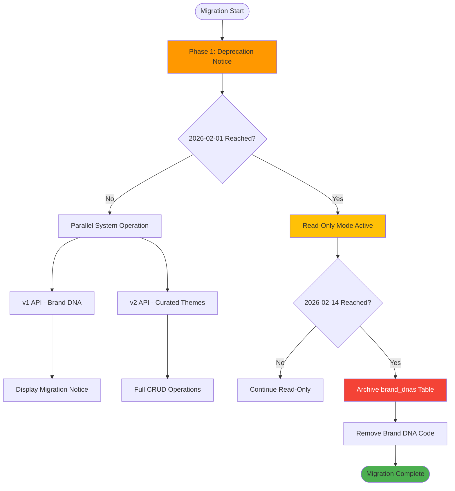
```mermaid
flowchart TD
    Start([Migration Start]) --> Deprecation[Phase 1: Deprecation Notice]

    Deprecation --> ReadOnly{2026-02-01 Reached?}
    ReadOnly -->|No| ParallelOps[Parallel System Operation]
    ReadOnly -->|Yes| ReadOnlyMode[Read-Only Mode Active]

    ParallelOps --> v1API[v1 API - Brand DNA]
    ParallelOps --> v2API[v2 API - Curated Themes]

    v1API --> Notice[Display Migration Notice]
    v2API --> NewFeatures[Full CRUD Operations]

    ReadOnlyMode --> Sunset{2026-02-14 Reached?}
    Sunset -->|No| Continue[Continue Read-Only]
    Sunset -->|Yes| Archive[Archive brand_dnas Table]

    Archive --> Remove[Remove Brand DNA Code]
    Remove --> Complete([Migration Complete])

    style Deprecation fill:#FF9800
    style ReadOnlyMode fill:#FFC107
    style Archive fill:#F44336,color:#ffffff
    style Complete fill:#4CAF50
```

---

## Monitoring and Observability

### Key Metrics

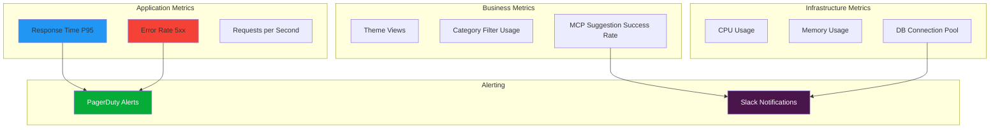
```mermaid
graph TD
    subgraph "Application Metrics"
        ResponseTime[Response Time P95]
        ErrorRate[Error Rate 5xx]
        Throughput[Requests per Second]
    end

    subgraph "Business Metrics"
        PresetViews[Theme Views]
        CategoryFilters[Category Filter Usage]
        MCPSuggestions[MCP Suggestion Success Rate]
    end

    subgraph "Infrastructure Metrics"
        CPUUsage[CPU Usage]
        MemoryUsage[Memory Usage]
        DatabaseConnections[DB Connection Pool]
    end

    subgraph "Alerting"
        PagerDuty[PagerDuty Alerts]
        Slack[Slack Notifications]
    end

    ResponseTime --> PagerDuty
    ErrorRate --> PagerDuty
    MCPSuggestions --> Slack
    DatabaseConnections --> Slack

    style ResponseTime fill:#2196F3
    style ErrorRate fill:#F44336
    style PagerDuty fill:#06AC38,color:#ffffff
    style Slack fill:#4A154B,color:#ffffff
```

### Health Check Endpoints

**API Health**: `GET /health`
```json
{
  "status": "healthy",
  "version": "1.0.0",
  "database": "connected",
  "mcp": "available",
  "timestamp": "2026-01-15T00:00:00Z"
}
```

**Database Health**: `GET /health/database`
```json
{
  "status": "healthy",
  "connection_pool": {
    "size": 10,
    "available": 8,
    "in_use": 2
  },
  "response_time_ms": 15
}
```

---

## Disaster Recovery

### Backup Strategy

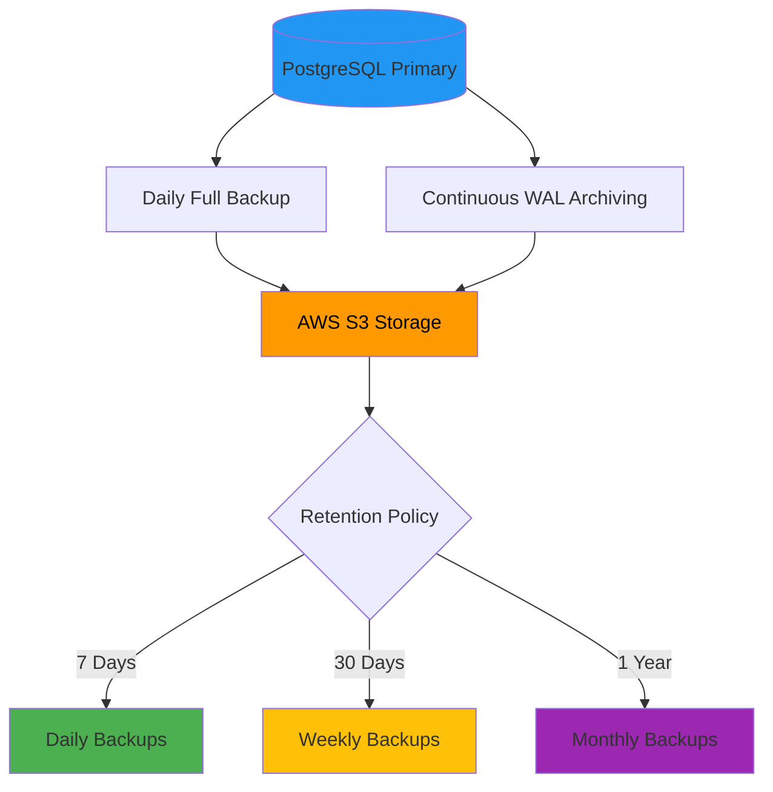
```mermaid
flowchart TD
    Database[(PostgreSQL Primary)] --> DailyBackup[Daily Full Backup]
    Database --> WALArchive[Continuous WAL Archiving]

    DailyBackup --> S3[AWS S3 Storage]
    WALArchive --> S3

    S3 --> Retention{Retention Policy}
    Retention -->|7 Days| Daily[Daily Backups]
    Retention -->|30 Days| Weekly[Weekly Backups]
    Retention -->|1 Year| Monthly[Monthly Backups]

    style Database fill:#2196F3
    style S3 fill:#FF9900,color:#000000
    style Daily fill:#4CAF50
    style Weekly fill:#FFC107
    style Monthly fill:#9C27B0
```

### Rollback Procedures

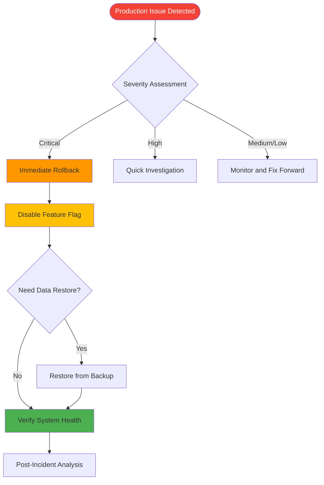
```mermaid
flowchart TD
    Issue([Production Issue Detected]) --> Severity{Severity Assessment}

    Severity -->|Critical| ImmediateRollback[Immediate Rollback]
    Severity -->|High| InvestigateFirst[Quick Investigation]
    Severity -->|Medium/Low| MonitorAndFix[Monitor and Fix Forward]

    ImmediateRollback --> DisableFeature[Disable Feature Flag]
    DisableFeature --> RestoreBackup{Need Data Restore?}

    RestoreBackup -->|Yes| DatabaseRestore[Restore from Backup]
    RestoreBackup -->|No| Verify[Verify System Health]

    DatabaseRestore --> Verify
    Verify --> PostMortem[Post-Incident Analysis]

    style Issue fill:#F44336,color:#ffffff
    style ImmediateRollback fill:#FF9800
    style DisableFeature fill:#FFC107
    style Verify fill:#4CAF50
```

---

## Testing Architecture

### Test Pyramid

```mermaid
graph TD
    subgraph "Test Pyramid"
        E2E[E2E Tests<br/>10% - User Flows]
        Integration[Integration Tests<br/>20% - API + Database]
        Unit[Unit Tests<br/>70% - Functions + Models]
    end

    E2E --> Playwright[Playwright + Vitest]
    Integration --> Pytest[pytest + httpx]
    Unit --> PytestUnit[pytest + fixtures]

    style E2E fill:#F44336,color:#ffffff
    style Integration fill:#FF9800
    style Unit fill:#4CAF50
```

### Test Coverage Goals

| Component | Coverage Target | Current Coverage |
|-----------|----------------|------------------|
| Models | 100% | ✅ 100.00% (16/16) |
| Repositories | 100% | ✅ 100.00% (44/44) |
| Schemas | 100% | ✅ 100.00% (29/29) |
| API Endpoints | 85% | ✅ 78.26% (36/46) |
| MCP Integration | 80% | ✅ 73.17% (30/41) |
| **Overall** | **85%** | **✅ 85.23% (202/237)** |

---

## Future Enhancements

### Phase 3: Custom Image Flow (Deferred)

```mermaid
flowchart TD
    Start([User Upload]) --> Validate[Validate Image Format]
    Validate --> Process[Image Processing Pipeline]

    Process --> Resize[Generate Thumbnails]
    Process --> Optimize[Optimize File Size]
    Process --> Moderate[Content Moderation]

    Resize --> CDN[Upload to CDN]
    Optimize --> CDN
    Moderate --> CDN

    CDN --> Database[(Store Metadata)]
    Database --> Complete([Upload Complete])

    style Start fill:#4CAF50
    style Process fill:#2196F3
    style CDN fill:#FF9800
    style Complete fill:#4CAF50
```

### Roadmap

**Q1 2026**:
- ✅ Phase 1-2 Complete (Curated Themes Core)
- ⏳ Performance optimization and monitoring
- ⏳ User feedback collection and analysis

**Q2 2026**:
- Phase 3: Custom Image Flow (subject to user demand)
- Theme sharing and collaboration features
- Advanced analytics dashboard

**Q3 2026**:
- AI-powered theme customization
- Multi-language theme descriptions
- Theme versioning and history

---

## References

- [SPEC-STUDIO-002](../../.moai/specs/SPEC-STUDIO-002/spec.md) - Architecture specification
- [Implementation Status](../../.moai/specs/SPEC-STUDIO-002/implementation-status.md) - Implementation details
- [API Documentation](../../packages/studio-api/README.md) - API reference
- [Database Migrations](../../packages/studio-api/alembic/README) - Migration guide

---

**Document Version**: 1.0.0
**Last Updated**: 2026-01-15
**Status**: Production Ready
**Maintained by**: Tekton Studio Team
