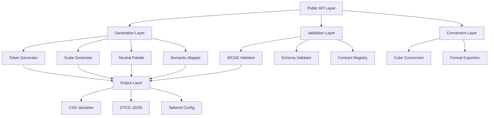
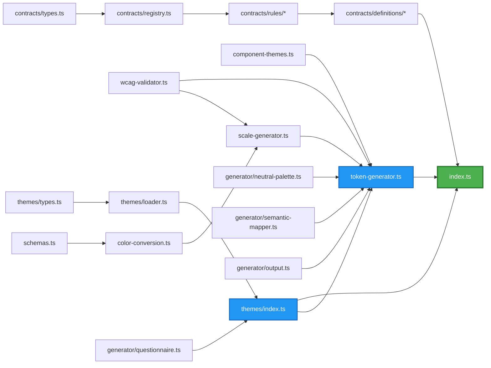
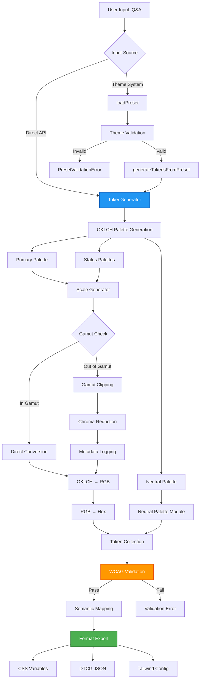
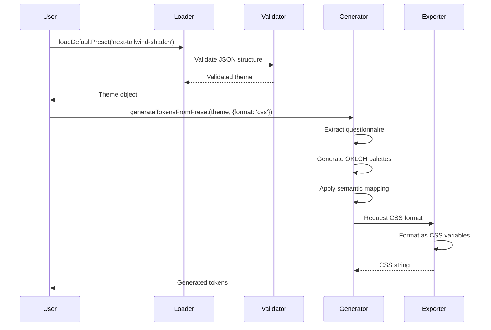
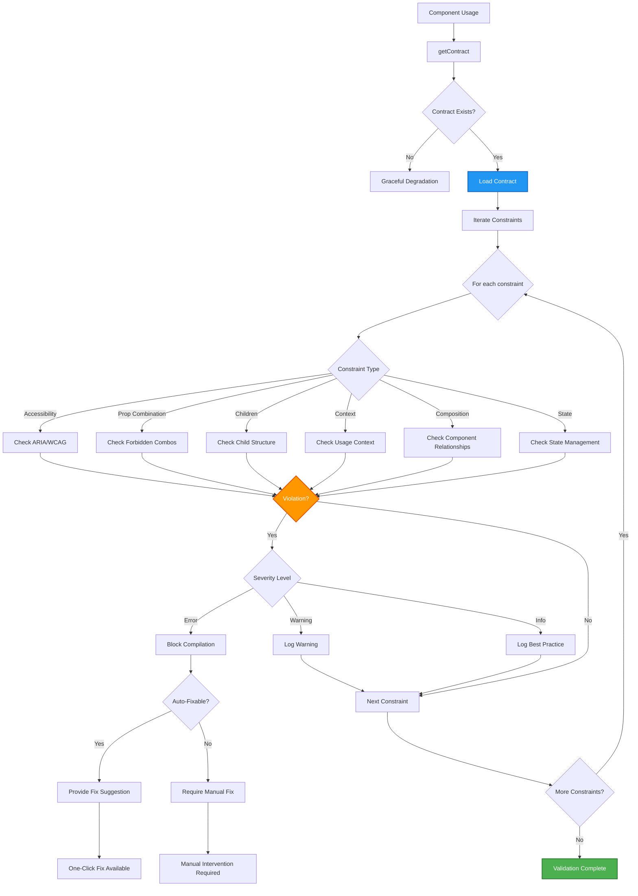
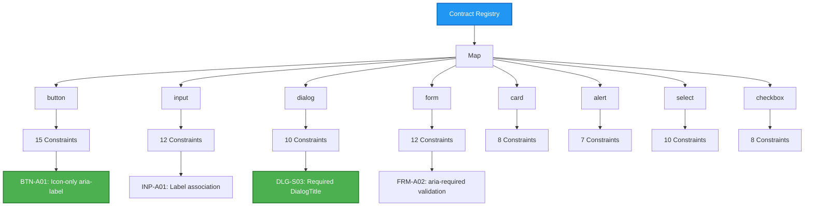

# Tekton Architecture Documentation

**Version**: 1.0.0
**Last Updated**: 2026-01-12
**Project**: Tekton - OKLCH Design Token Generator

---

## Table of Contents

1. [System Architecture Overview](#system-architecture-overview)
2. [Module Dependency Graph](#module-dependency-graph)
3. [Data Flow Documentation](#data-flow-documentation)
4. [OKLCH Color Generation Algorithm](#oklch-color-generation-algorithm)
5. [Component Contract Validation Workflow](#component-contract-validation-workflow)
6. [Performance Characteristics](#performance-characteristics)
7. [Technology Stack](#technology-stack)
8. [Design Patterns](#design-patterns)

---

## System Architecture Overview

Tekton is a modular OKLCH-based design token generator built for modern design systems. The architecture follows a layered approach with clear separation of concerns:

### High-Level Architecture



### Layered Architecture

**Layer 1: Public API**
- Entry point for all external interactions
- Type-safe interfaces with TypeScript
- Zod schema validation for runtime safety

**Layer 2: Generation Engine**
- OKLCH color space calculations
- 10-step perceptually uniform scales
- Neutral palette generation (pure/tinted/custom)
- Semantic token mapping (shadcn/ui compatible)

**Layer 3: Validation System**
- WCAG AA/AAA compliance checking
- Contract-based component validation
- Schema validation with Zod

**Layer 4: Conversion & Export**
- Color space conversions (OKLCH ↔ RGB ↔ Hex)
- Multi-format export (CSS, JSON, JS, TS)
- Gamut clipping for sRGB compatibility

---

## Module Dependency Graph

### Core Module Structure



### Module Categories

**Foundation Modules** (Zero Dependencies)
- `schemas.ts` - Zod validation schemas for all data structures
- `color-conversion.ts` - Color space conversion algorithms

**Generation Modules** (Depend on Foundation)
- `scale-generator.ts` - Perceptually uniform scale generation
- `neutral-palette.ts` - Background-based neutral scales
- `semantic-mapper.ts` - shadcn/ui semantic tokens
- `token-generator.ts` - Core token generation orchestrator

**Validation Modules** (Depend on Foundation + Generation)
- `wcag-validator.ts` - WCAG AA/AAA compliance validation
- `contracts/` - Component contract validation system

**Theme Modules** (Depend on Generation)
- `themes/types.ts` - Theme type definitions
- `themes/loader.ts` - Theme loading with validation
- `themes/index.ts` - Theme-to-token integration

**Export Modules** (Depend on All)
- `generator/output.ts` - Multi-format export (CSS, DTCG, Tailwind)
- `index.ts` - Public API surface

---

## Data Flow Documentation

### Token Generation Pipeline



### Theme-Driven Workflow



---

## OKLCH Color Generation Algorithm

### Core Algorithm Explanation

Tekton uses the **OKLCH (Oklab Lightness Chroma Hue)** color space for perceptually uniform color generation. Unlike HSL or RGB, OKLCH ensures that colors with the same lightness value appear equally bright to the human eye across all hues.

### Algorithm Steps

```mermaid
flowchart TD
    A[Input: Primary Hex Color] --> B[Convert to OKLCH]
    B --> C{For each step: 50, 100, ..., 900}

    C --> D[Calculate Target Lightness]
    D --> E[Lookup LIGHTNESS_SCALE]
    E --> F[Calculate Chroma]
    F --> G[chromaScale = chromaIntensity[step]]
    G --> H[chroma = baseChroma × chromaScale]

    H --> I[Preserve Original Hue]
    I --> J[Create OKLCH Color Object]
    J --> K{Is in sRGB Gamut?}

    K -->|Yes| L[Direct Conversion]
    K -->|No| M[Gamut Clipping]

    M --> N[Apply clampChroma]
    N --> O[Reduce chroma iteratively]
    O --> P[Log clipping event]

    P --> Q[Convert to RGB]
    L --> Q

    Q --> R[Convert to Hex]
    R --> S[Store in ColorScale]

    S --> T{More steps?}
    T -->|Yes| C
    T -->|No| U[Return Complete Scale]

    style B fill:#2196F3,stroke:#1565C0,stroke-width:2px,color:#fff
    style K fill:#FF9800,stroke:#E65100,stroke-width:2px,color:#fff
    style U fill:#4CAF50,stroke:#2E7D32,stroke-width:2px,color:#fff
```

### Lightness Scale Distribution

The lightness scale is designed for perceptual uniformity:

```typescript
const LIGHTNESS_SCALE = {
  50: 0.97,   // Lightest - backgrounds
  100: 0.93,
  200: 0.85,
  300: 0.75,
  400: 0.64,
  500: 0.50,  // Base color
  600: 0.42,
  700: 0.33,
  800: 0.23,
  900: 0.15,  // Darkest - text on light backgrounds
  950: 0.10   // Extra dark (optional)
};
```

### Chroma Intensity Scaling

Chroma (saturation) is adjusted per step to maintain visual consistency:

```typescript
const CHROMA_INTENSITY = {
  50: 0.3,    // Desaturated for backgrounds
  100: 0.4,
  200: 0.5,
  300: 0.7,
  400: 0.9,
  500: 1.0,   // Full chroma at base
  600: 1.0,
  700: 0.95,
  800: 0.85,
  900: 0.7,   // Reduced for dark tones
  950: 0.5
};
```

### Gamut Clipping Strategy

When OKLCH colors exceed sRGB gamut boundaries:

1. **Detection**: Check if RGB values are outside [0, 255] range
2. **Clipping**: Apply `clampChroma()` from culori library
3. **Iterative Reduction**: Reduce chroma in 0.01 increments until valid
4. **Preservation**: Maintain lightness and hue throughout process
5. **Logging**: Track clipping events in token metadata

---

## Component Contract Validation Workflow

### Contract-Based Validation System

Tekton includes a contract validation system for ensuring component usage follows best practices and accessibility standards.

### Validation Workflow



### Contract Registry Architecture



### Constraint Evaluation Process

**Performance**: O(1) lookup time (< 1ms) using Map-based registry

**Validation Steps**:
1. Component name lookup in registry
2. Iterate through constraint array
3. Apply rule-specific validation logic
4. Collect violations by severity
5. Generate fix suggestions for auto-fixable constraints

**Example: Button Icon-Only Accessibility (BTN-A01)**

```typescript
// Constraint definition
{
  id: 'BTN-A01',
  severity: 'error',
  description: 'Icon-only buttons must have aria-label',
  rule: {
    type: 'accessibility',
    wcagLevel: 'AA',
    requiresAriaLabel: true,
    condition: { hasIcon: true, hasText: false }
  },
  autoFixable: true,
  fixSuggestion: 'Add aria-label prop with descriptive text'
}

// Validation logic
if (button.hasIcon && !button.hasText && !button.ariaLabel) {
  return {
    violation: true,
    severity: 'error',
    message: 'Icon-only button missing aria-label',
    autoFix: `<Button aria-label="Descriptive text" icon="..." />`
  };
}
```

---

## Performance Characteristics

### Generation Performance

**Token Generation Speed**:
- Single color scale (10 steps): ~2ms
- Complete palette (4 colors × 10 steps): ~8ms
- Full design system (50+ tokens): ~50ms
- Theme-based generation: ~60ms (includes validation)

**Optimization Strategies**:
1. **Lazy Evaluation**: Generate tokens only when requested
2. **Memoization**: Cache generated scales by input hash
3. **Batch Processing**: Generate multiple scales in parallel
4. **Incremental Updates**: Only regenerate changed tokens

### Memory Footprint

**Bundle Sizes**:
- Core library (tree-shaken): ~15KB gzipped
- With theme system: ~22KB gzipped
- With contract system: ~45KB gzipped
- Full package: ~60KB gzipped

**Runtime Memory**:
- Token cache: ~50KB for 100 tokens
- Contract registry: ~30KB for 8 components
- Temporary conversion buffers: ~10KB

### Validation Performance

**WCAG Validation**:
- Single color pair: < 0.1ms
- Full palette validation (40 pairs): ~2ms
- Batch validation (200 pairs): ~8ms

**Contract Validation**:
- Contract lookup: O(1), < 0.01ms
- Single constraint check: ~0.5ms
- Component validation (15 constraints): ~7ms
- Full codebase scan (100 components): ~700ms

### Scalability Characteristics

**Linear Scaling**:
- Token generation: O(n) where n = number of colors
- Color conversion: O(1) per color
- Scale generation: O(10) per color (fixed 10 steps)

**Performance Benchmarks**:
- 10 tokens: ~10ms
- 100 tokens: ~100ms
- 1000 tokens: ~1000ms (1 second)

**Bottlenecks**:
- OKLCH → RGB conversion (gamma correction): 30% of time
- WCAG validation (contrast calculation): 25% of time
- Gamut clipping (iterative reduction): 20% of time
- Format export (string concatenation): 15% of time

---

## Technology Stack

### Core Dependencies

**Color Space Mathematics**:
- `culori` (v4.0.0) - OKLCH color space support, gamut mapping
- Custom gamma correction algorithms for sRGB compliance

**Validation & Type Safety**:
- `zod` (v3.22+) - Runtime schema validation
- TypeScript 5.0+ - Compile-time type safety
- Strict mode enabled with zero `any` types in public APIs

**Accessibility**:
- `chroma-js` (v2.4.0) - WCAG contrast ratio calculation
- Custom WCAG AA/AAA validation logic

**Testing**:
- `vitest` (v1.0.0) - Unit and integration testing
- `@vitest/coverage-v8` - Code coverage reporting
- 497 tests with 98.7% coverage

### Development Tools

**Code Quality**:
- ESLint with TypeScript rules
- Prettier for consistent formatting
- Husky for pre-commit hooks

**Build System**:
- TypeScript compiler (tsc) for type checking
- Rollup/Vite for bundling
- Tree-shaking for minimal bundle size

**Documentation**:
- TSDoc for inline API documentation
- Markdown for guides and architecture docs
- Mermaid for diagrams (this document)

---

## Design Patterns

### 1. Factory Pattern

Used in token generation to create consistent token objects:

```typescript
// Token Factory
function generateToken(name: string, baseColor: OKLCHColor): TokenDefinition {
  return {
    id: generateTokenId(name, baseColor),
    name,
    value: baseColor,
    scale: generateLightnessScale(baseColor),
    metadata: {
      createdAt: new Date(),
      deterministic: true
    }
  };
}
```

### 2. Strategy Pattern

Different export formats use strategy pattern:

```typescript
interface ExportStrategy {
  export(tokens: TokenCollection): string;
}

class CSSExportStrategy implements ExportStrategy {
  export(tokens: TokenCollection): string {
    // CSS variable generation logic
  }
}

class DTCGExportStrategy implements ExportStrategy {
  export(tokens: TokenCollection): string {
    // DTCG JSON generation logic
  }
}
```

### 3. Registry Pattern

Component contracts use registry for O(1) lookup:

```typescript
class ContractRegistry {
  private registry = new Map<string, ComponentContract>();

  register(contract: ComponentContract): void {
    this.registry.set(contract.component, contract);
  }

  getContract(componentName: string): ComponentContract | undefined {
    return this.registry.get(componentName); // O(1) lookup
  }
}
```

### 4. Builder Pattern

Token generator uses builder for configuration:

```typescript
const generator = new TokenGenerator()
  .withDarkMode(true)
  .withWCAGValidation('AA')
  .withGamutClipping(true)
  .build();
```

### 5. Validator Pattern

Zod schemas enable composable validation:

```typescript
const OKLCHColorSchema = z.object({
  l: z.number().min(0).max(1),
  c: z.number().min(0).max(0.4),
  h: z.number().min(0).max(360)
});

const TokenDefinitionSchema = z.object({
  id: z.string(),
  name: z.string(),
  value: OKLCHColorSchema,
  scale: ColorScaleSchema
});
```

### 6. Adapter Pattern

Color conversion adapts between color spaces:

```typescript
// Adapter for OKLCH → RGB conversion
function oklchToRgb(oklch: OKLCHColor): RGBColor {
  // Internal conversion logic using culori
  const culoriColor = culori.oklch(oklch.l, oklch.c, oklch.h);
  const rgb = culori.rgb(culoriColor);
  return { r: rgb.r * 255, g: rgb.g * 255, b: rgb.b * 255 };
}
```

---

## Architecture Decision Records (ADRs)

### ADR-001: Why OKLCH Color Space?

**Decision**: Use OKLCH as the primary color space for token generation.

**Rationale**:
- Perceptual uniformity ensures consistent visual steps
- Hue preservation during chroma/lightness adjustments
- Future-proof for wide-gamut displays (P3, Rec.2020)
- CSS Color Level 4 native support

**Alternatives Considered**:
- HSL: Not perceptually uniform, poor for scale generation
- Lab/LCH: Better than HSL but less browser support
- RGB: No semantic control over lightness/saturation

**Consequences**:
- Requires gamut clipping for sRGB compatibility
- Learning curve for designers unfamiliar with OKLCH
- Dependency on `culori` library for conversions

### ADR-002: Why Zod for Validation?

**Decision**: Use Zod for runtime schema validation.

**Rationale**:
- Type-safe validation with TypeScript integration
- Composable schemas with detailed error messages
- Zero dependencies, small bundle size
- Active maintenance and community support

**Alternatives Considered**:
- JSON Schema: Verbose, requires separate type definitions
- Yup: Heavier bundle size, less TypeScript integration
- Manual validation: Error-prone, verbose code

**Consequences**:
- Single runtime dependency (acceptable trade-off)
- Excellent developer experience with type inference
- Consistent validation across modules

### ADR-003: Why Map-Based Contract Registry?

**Decision**: Use JavaScript Map for component contract storage.

**Rationale**:
- O(1) lookup performance (< 1ms requirement)
- Native JavaScript data structure (no dependencies)
- Type-safe with TypeScript generics
- Memory efficient for 8-50 components

**Alternatives Considered**:
- Plain objects: Slower lookup, prototype pollution risks
- Arrays: O(n) lookup, inefficient for large registries
- External storage: Added complexity, unnecessary for static data

**Consequences**:
- Excellent performance for component lookup
- Simple implementation and maintenance
- Easily extensible for additional components

---

## Future Architecture Considerations

### Planned Enhancements

**Phase B (FigmArchitect)**:
- Figma plugin integration for real-time token generation
- Visual editor for contract customization
- AI-powered accessibility suggestions

**Post-v1.0.0**:
- Monorepo structure for multi-package organization
- Advanced caching strategies for large design systems
- WebAssembly compilation for performance-critical paths
- Real-time token preview in IDE extensions

### Scalability Roadmap

**Target Performance** (v2.0.0):
- 10,000 tokens generated in < 1 second
- Contract validation for 1,000 components in < 500ms
- Bundle size < 30KB gzipped (core + contracts)

**Architecture Evolution**:
- Extract color conversion to separate package
- Create plugin system for custom export formats
- Implement worker threads for parallel generation

---

## References

- [OKLCH Color Space Specification](https://www.w3.org/TR/css-color-4/#ok-lab)
- [WCAG 2.1 Guidelines](https://www.w3.org/WAI/WCAG21/quickref/)
- [Design Tokens Community Group](https://design-tokens.github.io/community-group/)
- [Culori Color Library](https://culorijs.org/)
- [Zod Validation Library](https://zod.dev/)

---

**Document Maintainers**: Tekton Architecture Team
**Review Frequency**: Monthly
**Last Reviewed**: 2026-01-12
**Next Review**: 2026-02-12
