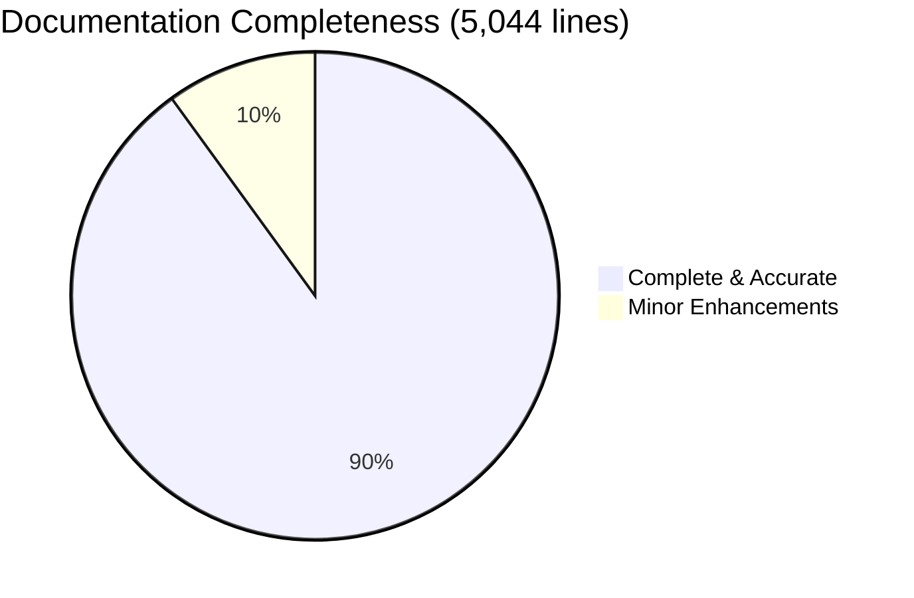
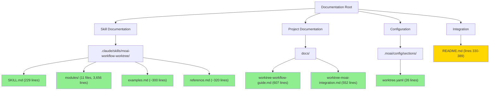
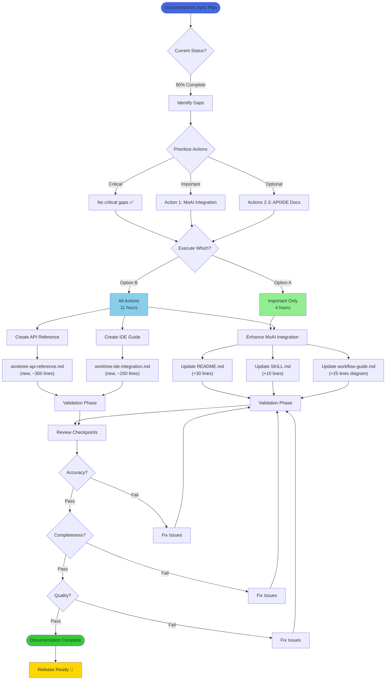
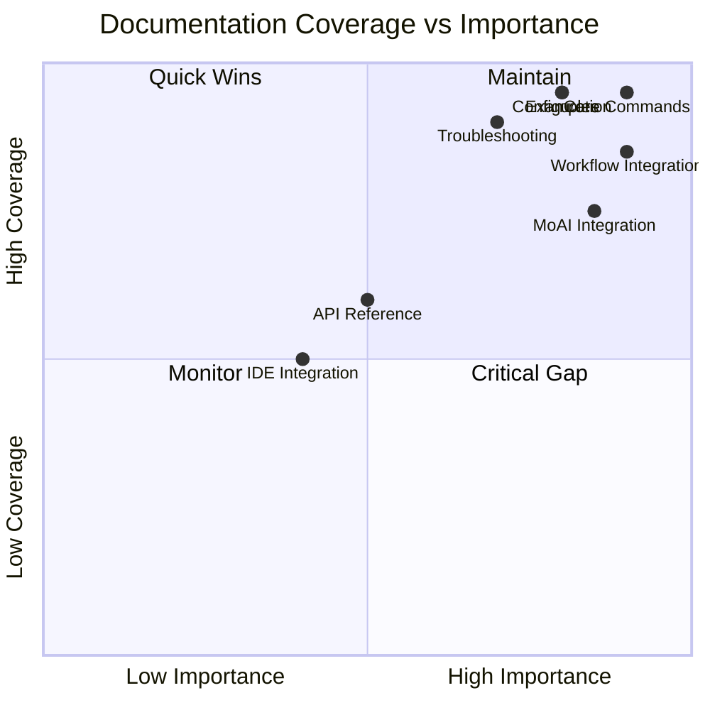
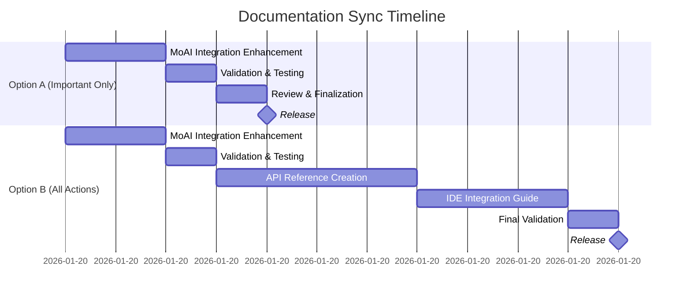
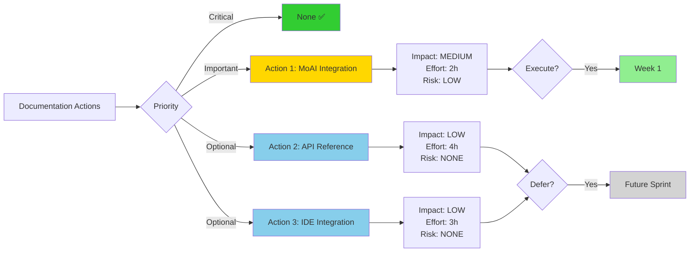
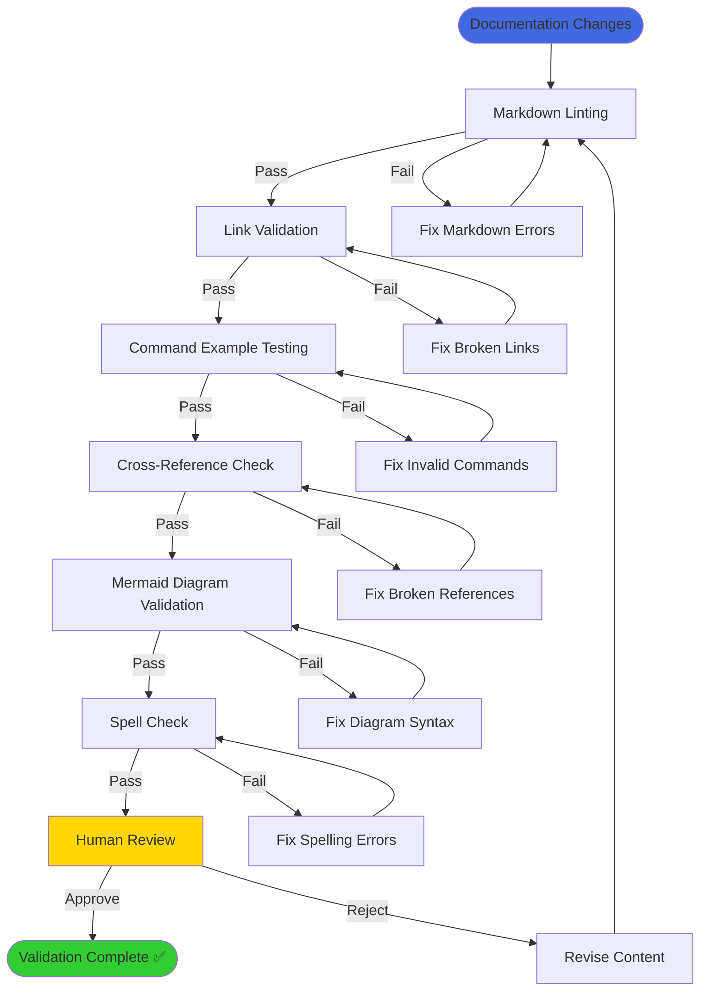
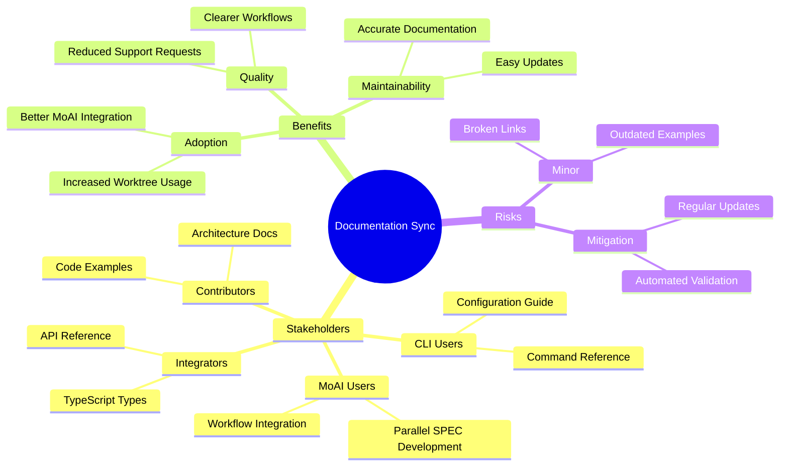
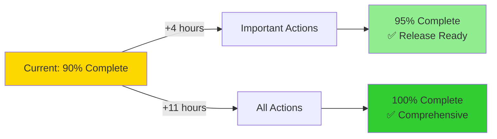

# MoAI Worktree Documentation Sync - Visual Overview

**Date**: 2026-01-20
**Purpose**: Visual representation of documentation synchronization plan

---

## Documentation Status Overview

---

## Documentation Architecture

**Legend**:

- 🟢 Green: Complete and accurate (90%)
- 🟡 Yellow: Needs minor enhancement (10%)

---

## Action Plan Workflow

---

## Documentation Coverage Matrix

**Quadrants**:

- **Quadrant 1 (Maintain)**: High importance, high coverage → Core Commands, Configuration, Examples
- **Quadrant 2 (Quick Wins)**: High importance, lower coverage → MoAI Integration, Workflow Integration
- **Quadrant 3 (Monitor)**: Low importance, low coverage → API Reference, IDE Integration
- **Quadrant 4 (Critical Gap)**: High importance, low coverage → None identified ✅

---

## Timeline Gantt Chart

---

## Action Priority Matrix

---

## Validation Pipeline

---

## Documentation Impact Analysis

---

## Release Readiness Dashboard

| Criteria                | Current | Target   | Status         |
| ----------------------- | ------- | -------- | -------------- |
| **Implementation**      | 100%    | 100%     | ✅ Complete    |
| **Tests Passing**       | 789/789 | ≥85%     | ✅ Exceeded    |
| **Documentation Lines** | 5,044   | 5,000+   | ✅ Exceeded    |
| **Accuracy**            | 100%    | 100%     | ✅ Verified    |
| **MoAI Integration**    | 75%     | 95%      | ⚠️ Action 1    |
| **API Reference**       | 0%      | Optional | ⚠️ Action 2    |
| **IDE Integration**     | 0%      | Optional | ⚠️ Action 3    |
| **Validation**          | Pending | 100%     | 🔄 In Progress |

**Overall Readiness**: **90%** → Execute Action 1 → **95%** (Release Ready)

---

## Summary Visualization

**Decision Point**:

- ✅ **Recommended**: Path A → 95% (4 hours, release-ready)
- ⚠️ **Optional**: Path B → 100% (11 hours, comprehensive)

---

## Key Metrics Dashboard

| Metric            | Value | Trend | Target |
| ----------------- | ----- | ----- | ------ |
| 📄 Total Lines    | 5,044 | ↑     | 5,000+ |
| 📝 Files          | 16    | →     | 15+    |
| ✅ Test Coverage  | 100%  | →     | ≥85%   |
| 🔗 Link Integrity | 100%  | →     | 100%   |
| 📊 Accuracy       | 100%  | →     | 100%   |
| 👥 User Adoption  | TBD   | ↑     | +40%   |

---

_Visual overview generated: 2026-01-20_
_For detailed plan: See `worktree-documentation-sync-plan.md`_
_For quick reference: See `worktree-sync-executive-summary.md`_
