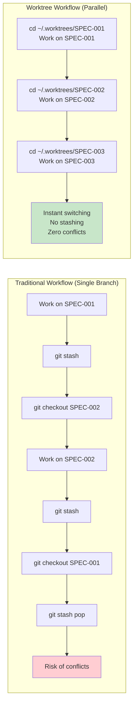
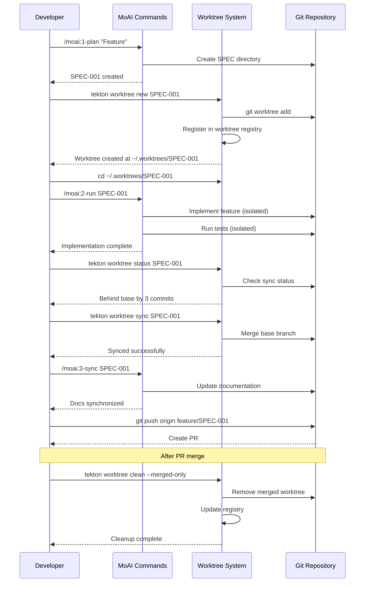

# Tekton Worktree Workflow Integration Guide

**Version**: 1.0.0
**Last Updated**: 2026-01-20
**Status**: Complete Implementation

---

## Table of Contents

1. [Overview](#overview)
2. [Why Use Worktrees for SPEC Development](#why-use-worktrees-for-spec-development)
3. [Integration with MoAI Workflow](#integration-with-moai-workflow)
4. [Complete Workflow Examples](#complete-workflow-examples)
5. [Best Practices](#best-practices)
6. [Troubleshooting](#troubleshooting)
7. [Advanced Patterns](#advanced-patterns)

---

## Overview

The Tekton Worktree Management System provides isolated Git workspaces for parallel SPEC development. Each SPEC gets its own worktree with independent Git state, enabling true parallel development without context switching overhead.

### Core Benefits

- **Isolation**: Each SPEC has its own directory and Git branch
- **Parallel Development**: Work on multiple SPECs simultaneously
- **Zero Context Switching**: Instant switching between worktrees
- **Clean Integration**: Automatic sync with base branch
- **Safe Experimentation**: Isolated environment for testing

### System Requirements

- Git 2.5+ (for worktree support)
- Node.js 20+ (for Tekton CLI)
- Unix-like environment (macOS, Linux, WSL)

---

## Why Use Worktrees for SPEC Development

### Traditional Branch Workflow Pain Points

**Single Branch Development**:

```bash
# Problem: Switching branches requires clean working directory
git checkout feature/SPEC-001
# Work on SPEC-001...
git stash  # Must stash changes
git checkout feature/SPEC-002
# Work on SPEC-002...
git checkout feature/SPEC-001
git stash pop  # Restore changes
```

**Issues**:

- Frequent `git stash` operations
- Risk of losing uncommitted work
- Context switching overhead
- Conflicts when switching branches
- Single development environment

### Worktree Solution

**Parallel Worktree Development**:

```bash
# Create isolated worktrees
tekton worktree new SPEC-001 "User Authentication"
tekton worktree new SPEC-002 "Payment System"

# Switch instantly between worktrees
cd ~/.worktrees/SPEC-001  # Work on authentication
cd ~/.worktrees/SPEC-002  # Work on payments

# No stashing, no conflicts, independent development
```

**Benefits**:

- Each SPEC has its own directory
- Independent Git state per worktree
- Simultaneous development on multiple SPECs
- Isolated dependencies and configuration
- Instant switching without stashing

---

## Integration with MoAI Workflow

The worktree system integrates seamlessly with the MoAI Plan-Run-Sync workflow.

### Visual Workflow Overview

```mermaid
graph TB
    Start([Developer starts new SPEC]) --> Plan[/moai:1-plan Feature Description/]

    Plan --> SpecCreated[SPEC Created<br/>.moai/specs/SPEC-ID/]
    SpecCreated --> CreateWorktree{Create Worktree?}

    CreateWorktree -->|Yes - Parallel Dev| WorktreeNew[tekton worktree new SPEC-ID]
    CreateWorktree -->|No - Single Dev| MainRepo[Work in main repo]

    WorktreeNew --> Isolated[Isolated Worktree<br/>~/.worktrees/SPEC-ID/<br/>Branch: feature/SPEC-ID]
    Isolated --> SwitchWorktree[cd ~/.worktrees/SPEC-ID]

    SwitchWorktree --> Develop[/moai:2-run SPEC-ID/<br/>TDD Implementation]
    MainRepo --> Develop

    Develop --> Tests{Tests<br/>Passing?}
    Tests -->|No| Debug[Debug and Fix]
    Debug --> Develop
    Tests -->|Yes| CheckStatus[tekton worktree status SPEC-ID]

    CheckStatus --> NeedSync{Behind<br/>Base Branch?}
    NeedSync -->|Yes| Sync[tekton worktree sync SPEC-ID<br/>Merge base changes]
    NeedSync -->|No| DocSync
    Sync --> DocSync[/moai:3-sync SPEC-ID/<br/>Documentation Sync]

    DocSync --> Push[git push origin feature/SPEC-ID]
    Push --> PR[Create Pull Request]

    PR --> Review{Code<br/>Review}
    Review -->|Changes Requested| MoreWork[Address feedback]
    MoreWork --> Develop
    Review -->|Approved| Merge[Merge PR to master]

    Merge --> Cleanup[tekton worktree clean --merged-only]
    Cleanup --> End([SPEC Complete])

    style Plan fill:#e1f5ff
    style Develop fill:#fff4e1
    style DocSync fill:#e8f5e9
    style Isolated fill:#f3e5f5
    style Cleanup fill:#fce4ec
    style End fill:#c8e6c9
```

### Parallel Development Comparison



### MoAI Command Integration Points



---

### Phase 1: /moai:1-plan (Planning Phase)

**Without Worktrees**:

```bash
# Traditional approach
/moai:1-plan "User Authentication System"
# Creates: .moai/specs/SPEC-AUTH-001/
# Works in main repository
```

**With Worktrees**:

```bash
# Step 1: Create SPEC
/moai:1-plan "User Authentication System"
# Creates: .moai/specs/SPEC-AUTH-001/

# Step 2: Create isolated worktree
tekton worktree new SPEC-AUTH-001 "User Authentication System"

# Output:
# ✓ Worktree created successfully
#   Path: /Users/yourname/.worktrees/SPEC-AUTH-001
#   Branch: feature/SPEC-AUTH-001
#   Base: master

# Step 3: Switch to worktree
cd ~/.worktrees/SPEC-AUTH-001
```

**Integration Point**: After `/moai:1-plan` completes, suggest creating a worktree for isolated development.

### Phase 2: /moai:2-run (Development Phase)

**Worktree-Aware Development**:

```bash
# Navigate to worktree
cd ~/.worktrees/SPEC-AUTH-001

# Run TDD implementation in isolated environment
/moai:2-run SPEC-AUTH-001

# All changes are isolated to this worktree
# No risk of affecting other SPECs
```

**Benefits**:

- Independent test execution per SPEC
- Isolated dependency installation
- No cross-contamination between SPECs
- Safe experimentation without affecting main repo

**Integration Point**: Detect if currently in worktree, show worktree context in output.

### Phase 3: /moai:3-sync (Synchronization Phase)

**Pre-PR Synchronization**:

```bash
# Check worktree status before creating PR
tekton worktree status SPEC-AUTH-001

# Output:
# Current status:
#   Ahead: 5 commits
#   Behind: 2 commits  ← Base branch has new commits
#   Uncommitted changes: 0 files

# Sync with base branch
tekton worktree sync SPEC-AUTH-001

# Output:
# ✓ Worktree synced successfully
#   Strategy: merge
#   Synced: 2 commits

# Now create PR
/moai:3-sync SPEC-AUTH-001
```

**Integration Point**: Before `/moai:3-sync`, check if worktree needs sync with base branch.

### Phase 4: Post-PR Cleanup

**After PR Merge**:

```bash
# Clean up merged worktrees automatically
tekton worktree clean --merged-only

# Output:
# Found 2 merged worktrees:
#   SPEC-AUTH-001 (merged 2 days ago)
#   SPEC-PAY-001 (merged 1 week ago)
#
# Remove these worktrees? (y/n): y
# ✓ Removed SPEC-AUTH-001
# ✓ Removed SPEC-PAY-001
```

**Integration Point**: After successful PR merge, suggest cleanup of worktree.

---

## Complete Workflow Examples

### Example 1: Single SPEC Development

**Scenario**: Implementing user authentication feature

```bash
# 1. Plan Phase - Create SPEC
/moai:1-plan "User Authentication System"
# Output: Created SPEC-AUTH-001

# 2. Create worktree
tekton worktree new SPEC-AUTH-001 "User Authentication System"
cd ~/.worktrees/SPEC-AUTH-001

# 3. Development Phase - Implement with TDD
/moai:2-run SPEC-AUTH-001
# Iterate: Write tests, implement features, refactor

# 4. Check worktree status before PR
cd /path/to/main/repo
tekton worktree status SPEC-AUTH-001

# 5. Sync with base branch
tekton worktree sync SPEC-AUTH-001

# 6. Create PR
/moai:3-sync SPEC-AUTH-001

# 7. After PR merge, cleanup
tekton worktree clean --merged-only
```

### Example 2: Parallel SPEC Development

**Scenario**: Working on 3 features simultaneously

```bash
# Create multiple SPECs with worktrees
/moai:1-plan "User Authentication"
tekton worktree new SPEC-AUTH-001 "User Authentication"

/moai:1-plan "Payment Processing"
tekton worktree new SPEC-PAY-001 "Payment Processing"

/moai:1-plan "Dashboard Analytics"
tekton worktree new SPEC-DASH-001 "Dashboard Analytics"

# View all active worktrees
tekton worktree list

# Output:
# SPEC ID         STATUS   PATH                                        BRANCH
# SPEC-AUTH-001   active   /Users/you/.worktrees/SPEC-AUTH-001        feature/SPEC-AUTH-001
# SPEC-PAY-001    active   /Users/you/.worktrees/SPEC-PAY-001         feature/SPEC-PAY-001
# SPEC-DASH-001   active   /Users/you/.worktrees/SPEC-DASH-001        feature/SPEC-DASH-001

# Work on authentication
cd ~/.worktrees/SPEC-AUTH-001
/moai:2-run SPEC-AUTH-001

# Switch to payment (instant, no stashing)
cd ~/.worktrees/SPEC-PAY-001
/moai:2-run SPEC-PAY-001

# Switch to dashboard
cd ~/.worktrees/SPEC-DASH-001
/moai:2-run SPEC-DASH-001

# Sync all before creating PRs
cd /path/to/main/repo
tekton worktree sync SPEC-AUTH-001
tekton worktree sync SPEC-PAY-001
tekton worktree sync SPEC-DASH-001

# Create PRs
/moai:3-sync SPEC-AUTH-001
/moai:3-sync SPEC-PAY-001
/moai:3-sync SPEC-DASH-001
```

### Example 3: Hotfix in Worktree

**Scenario**: Urgent bug fix while working on features

```bash
# Currently working on SPEC-001
cd ~/.worktrees/SPEC-001
# Development in progress...

# Urgent bug reported - create hotfix worktree
cd /path/to/main/repo
tekton worktree new SPEC-HOTFIX-001 "Critical Security Fix"

# Fix bug in isolated environment
cd ~/.worktrees/SPEC-HOTFIX-001
# Make fix, test, commit

# Sync and create PR immediately
cd /path/to/main/repo
tekton worktree sync SPEC-HOTFIX-001
/moai:3-sync SPEC-HOTFIX-001

# Return to feature development
cd ~/.worktrees/SPEC-001
# Continue where you left off, no context lost
```

---

## Best Practices

### 1. Worktree Naming Conventions

**Good**:

```bash
tekton worktree new SPEC-AUTH-001 "JWT Authentication with Refresh Tokens"
tekton worktree new SPEC-PAY-001 "Stripe Integration for Subscriptions"
tekton worktree new SPEC-DASH-001 "Real-time Analytics Dashboard"
```

**Bad**:

```bash
tekton worktree new SPEC-001 "auth"  # Too vague
tekton worktree new SPEC-TEST "test" # Not descriptive
```

### 2. Regular Synchronization

**Check sync status regularly**:

```bash
# Before starting work
tekton worktree status SPEC-001

# If behind base branch
tekton worktree sync SPEC-001

# Before creating PR
tekton worktree sync SPEC-001 --dry-run
tekton worktree sync SPEC-001
```

### 3. Cleanup Merged Worktrees

**Weekly cleanup**:

```bash
# Remove all merged worktrees
tekton worktree clean --merged-only

# Check what will be removed first
tekton worktree list --status merged
```

### 4. Configuration Management

**Set project-specific configuration**:

```bash
# Use project-specific worktree root
tekton worktree config set worktree_root ~/dev/myproject/worktrees

# Use develop as base branch
tekton worktree config set default_base develop

# Enable auto-cleanup
tekton worktree config set cleanup_merged true
```

### 5. Shell Integration

**Add to `.bashrc` or `.zshrc`**:

```bash
# Worktree aliases
alias tw='tekton worktree'
alias twl='tekton worktree list'
alias twn='tekton worktree new'
alias tws='tekton worktree switch'
alias twsync='tekton worktree sync'

# Quick worktree creation and switch
twgo() {
    tekton worktree new "$1" "$2"
    cd $(tekton worktree switch "$1")
}
```

---

## Troubleshooting

### Issue 1: Worktree Creation Fails

**Symptom**:

```bash
tekton worktree new SPEC-001 "Test"
# ✗ Invalid SPEC ID: SPEC-001
```

**Solution**:

```bash
# Use proper SPEC ID format: SPEC-XXX-001
tekton worktree new SPEC-ABC-001 "Test"
```

### Issue 2: Sync Conflicts

**Symptom**:

```bash
tekton worktree sync SPEC-001
# ✗ Merge conflict detected
```

**Solution**:

```bash
# 1. Navigate to worktree
cd ~/.worktrees/SPEC-001

# 2. Resolve conflicts manually
git status
# Edit conflicted files
git add .
git commit -m "Resolve merge conflicts"

# 3. Try sync again
cd -
tekton worktree sync SPEC-001
```

### Issue 3: Cannot Remove Worktree

**Symptom**:

```bash
tekton worktree remove SPEC-001
# ✗ Worktree has uncommitted changes
```

**Solution**:

```bash
# Option 1: Commit changes
cd ~/.worktrees/SPEC-001
git add .
git commit -m "Save work"
cd -
tekton worktree remove SPEC-001

# Option 2: Force remove (loses changes)
tekton worktree remove SPEC-001 --force
```

### Issue 4: Worktree Path Not Found

**Symptom**:

```bash
cd ~/.worktrees/SPEC-001
# bash: cd: /Users/you/.worktrees/SPEC-001: No such file or directory
```

**Solution**:

```bash
# Check configured worktree root
tekton worktree config get worktree_root

# List all worktrees with full paths
tekton worktree list

# Use the actual path from output
cd /actual/path/from/output
```

---

## Advanced Patterns

### Pattern 1: Worktree Per Team Member

**Scenario**: Multiple developers working on same SPEC

```bash
# Developer A creates base worktree
tekton worktree new SPEC-FEAT-001 "Payment Gateway"

# Developer B creates their own worktree from same branch
cd ~/.worktrees/SPEC-FEAT-001
git checkout -b feature/SPEC-FEAT-001-devB
cd -
# Create another worktree manually or use tekton commands
```

### Pattern 2: Experimental Worktrees

**Scenario**: Testing different approaches

```bash
# Create experimental worktrees
tekton worktree new SPEC-EXP-001 "Approach 1: REST API"
tekton worktree new SPEC-EXP-002 "Approach 2: GraphQL"

# Implement both approaches in parallel
cd ~/.worktrees/SPEC-EXP-001
# Implement REST approach

cd ~/.worktrees/SPEC-EXP-002
# Implement GraphQL approach

# Compare results, choose best approach
# Remove experimental worktrees
tekton worktree remove SPEC-EXP-001 --force
tekton worktree remove SPEC-EXP-002 --force
```

### Pattern 3: Long-Running Feature Branches

**Scenario**: Feature taking weeks to complete

```bash
# Create feature worktree
tekton worktree new SPEC-LONG-001 "Major Refactoring"

# Regularly sync with base branch
# Daily or weekly:
tekton worktree sync SPEC-LONG-001

# Keep worktree up to date with main development
# This prevents merge conflicts later
```

### Pattern 4: Code Review Worktrees

**Scenario**: Reviewing PR in isolation

```bash
# Create review worktree from PR branch
tekton worktree new SPEC-REVIEW-001 "Review PR #123"

cd ~/.worktrees/SPEC-REVIEW-001
git fetch origin pull/123/head:pr-123
git checkout pr-123

# Review code, test changes
# Make review comments

# Remove after review
cd -
tekton worktree remove SPEC-REVIEW-001 --force
```

---

## Quick Reference Card

### Common Commands

```bash
# Create worktree
tekton worktree new <SPEC-ID> "<description>"

# List worktrees
tekton worktree list

# Switch to worktree
cd $(tekton worktree switch <SPEC-ID>)

# Check status
tekton worktree status <SPEC-ID>

# Sync with base
tekton worktree sync <SPEC-ID>

# Remove worktree
tekton worktree remove <SPEC-ID>

# Clean merged
tekton worktree clean --merged-only
```

### Configuration

```bash
# View all config
tekton worktree config list

# Set config value
tekton worktree config set <key> <value>

# Get config value
tekton worktree config get <key>
```

### Integration Points

| Phase   | Command        | Worktree Action                  |
| ------- | -------------- | -------------------------------- |
| Plan    | `/moai:1-plan` | Suggest: `tekton worktree new`   |
| Run     | `/moai:2-run`  | Detect worktree context          |
| Sync    | `/moai:3-sync` | Check: `tekton worktree status`  |
| Post-PR | -              | Cleanup: `tekton worktree clean` |

---

## Conclusion

The Tekton Worktree Management System provides a powerful foundation for parallel SPEC development. By integrating worktrees into your MoAI workflow, you gain:

- **Isolation**: Independent development environments per SPEC
- **Efficiency**: Zero context switching overhead
- **Safety**: Experimental changes don't affect other work
- **Scalability**: Work on unlimited SPECs simultaneously

Follow this guide to integrate worktrees into your development workflow and experience true parallel development.

---

**Version**: 1.0.0
**Last Updated**: 2026-01-20
**Feedback**: Report issues or suggest improvements via `/moai:9-feedback`
