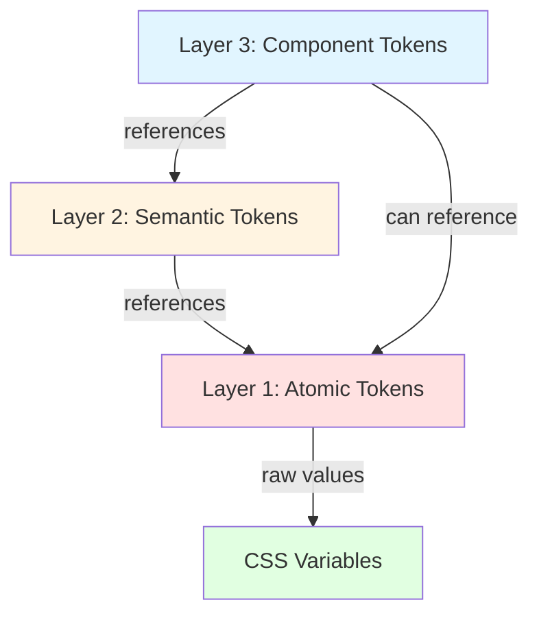
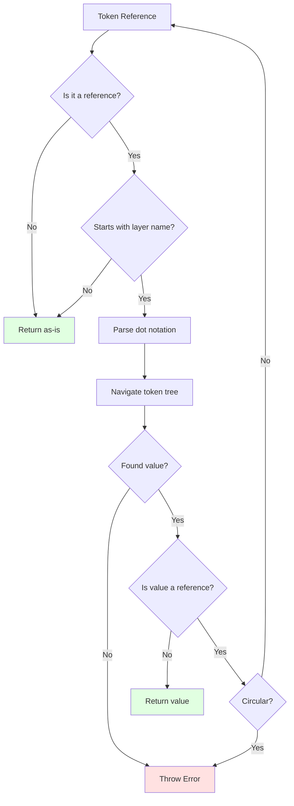

# Token System Guide

Complete guide to the 3-Layer Token System in @tekton/core.

## Table of Contents

- [Architecture Overview](#architecture-overview)
- [Layer 1: Atomic Tokens](#layer-1-atomic-tokens)
- [Layer 2: Semantic Tokens](#layer-2-semantic-tokens)
- [Layer 3: Component Tokens](#layer-3-component-tokens)
- [Token Resolution](#token-resolution)
- [Dark Mode](#dark-mode)
- [CSS Variables Generation](#css-variables-generation)
- [Validation](#validation)
- [Best Practices](#best-practices)

## Architecture Overview

The Token System provides a professional design token architecture with three distinct layers:



**Design Philosophy:**

- **Atomic Layer**: Foundation - raw design values that never reference other tokens
- **Semantic Layer**: Context - meaning-based mappings that reference atomic tokens
- **Component Layer**: Usage - component-specific bindings that reference semantic or atomic tokens

**Key Benefits:**

1. **Separation of Concerns**: Clear boundaries between design decisions
2. **Maintainability**: Change colors in one place, cascade everywhere
3. **Type Safety**: Full TypeScript support with compile-time checks
4. **Scalability**: Easy to extend with new components or variants
5. **Dark Mode**: Built-in support via token overrides

## Layer 1: Atomic Tokens

Atomic tokens are the foundation - raw design values that never reference other tokens.

### Structure

```typescript
interface AtomicTokens {
  color: {
    [palette: string]: {
      [shade: string]: string; // "500": "#3b82f6"
    };
  };
  spacing: {
    [size: string]: string; // "4": "16px"
  };
  radius: {
    [size: string]: string; // "md": "8px"
  };
  typography: {
    [name: string]: {
      fontSize: string;
      lineHeight: string;
      fontWeight: string;
    };
  };
  shadow: {
    [name: string]: string;
  };
  transition?: {
    [name: string]: string;
  };
}
```

### Example Definition

```typescript
const atomicTokens: AtomicTokens = {
  color: {
    blue: {
      '400': '#60a5fa',
      '500': '#3b82f6',
      '600': '#2563eb',
      '700': '#1d4ed8',
    },
    neutral: {
      '50': '#f9fafb',
      '100': '#f3f4f6',
      '200': '#e5e7eb',
      '900': '#111827',
    },
  },
  spacing: {
    '1': '4px',
    '2': '8px',
    '4': '16px',
    '8': '32px',
    '16': '64px',
  },
  radius: {
    sm: '4px',
    md: '8px',
    lg: '12px',
    xl: '16px',
  },
  typography: {
    body: {
      fontSize: '16px',
      lineHeight: '24px',
      fontWeight: '400',
    },
    heading: {
      fontSize: '24px',
      lineHeight: '32px',
      fontWeight: '700',
    },
  },
  shadow: {
    sm: '0 1px 2px 0 rgb(0 0 0 / 0.05)',
    md: '0 4px 6px -1px rgb(0 0 0 / 0.1)',
    lg: '0 10px 15px -3px rgb(0 0 0 / 0.1)',
  },
  transition: {
    default: '150ms cubic-bezier(0.4, 0, 0.2, 1)',
    fast: '100ms cubic-bezier(0.4, 0, 0.2, 1)',
  },
};
```

### CSS Variables Output

Atomic tokens generate CSS Variables with this pattern:

```css
:root {
  /* Colors */
  --color-blue-400: #60a5fa;
  --color-blue-500: #3b82f6;
  --color-neutral-50: #f9fafb;

  /* Spacing */
  --spacing-1: 4px;
  --spacing-4: 16px;

  /* Radius */
  --radius-md: 8px;

  /* Typography */
  --typography-body-size: 16px;
  --typography-body-line-height: 24px;
  --typography-body-weight: 400;

  /* Shadow */
  --shadow-md: 0 4px 6px -1px rgb(0 0 0 / 0.1);

  /* Transition */
  --transition-default: 150ms cubic-bezier(0.4, 0, 0.2, 1);
}
```

## Layer 2: Semantic Tokens

Semantic tokens provide meaning-based mappings that reference atomic tokens.

### Structure

```typescript
interface SemanticTokens {
  background: {
    page: string; // Page background
    surface: string; // Surface/card background
    elevated: string; // Elevated surface (modals, popovers)
    muted: string; // Muted/subtle background
    inverse: string; // Inverse background (dark on light theme)
  };
  foreground: {
    primary: string; // Primary text color
    secondary: string; // Secondary text color
    muted: string; // Muted/subtle text
    inverse: string; // Inverse text (light on dark bg)
    accent: string; // Accent/brand color
  };
  border: {
    default: string; // Default border color
    muted: string; // Subtle border
    focus: string; // Focus ring color
    error: string; // Error state border
  };
  surface: {
    primary: string; // Primary surface
    secondary: string; // Secondary surface
    tertiary: string; // Tertiary surface
    inverse: string; // Inverse surface
  };
}
```

### Example Definition

```typescript
const semanticTokens: SemanticTokens = {
  background: {
    page: 'atomic.color.neutral.50', // References atomic token
    surface: '#ffffff', // Direct value
    elevated: '#ffffff',
    muted: 'atomic.color.neutral.100',
    inverse: 'atomic.color.neutral.900',
  },
  foreground: {
    primary: 'atomic.color.neutral.900',
    secondary: '#6b7280',
    muted: '#9ca3af',
    inverse: '#ffffff',
    accent: 'atomic.color.blue.500',
  },
  border: {
    default: 'atomic.color.neutral.200',
    muted: 'atomic.color.neutral.100',
    focus: 'atomic.color.blue.500',
    error: 'atomic.color.red.500',
  },
  surface: {
    primary: '#ffffff',
    secondary: 'atomic.color.neutral.50',
    tertiary: 'atomic.color.neutral.100',
    inverse: 'atomic.color.neutral.900',
  },
};
```

### CSS Variables Output

```css
:root {
  /* Background */
  --background-page: #f9fafb; /* Resolved from atomic.color.neutral.50 */
  --background-surface: #ffffff;
  --background-muted: #f3f4f6;

  /* Foreground */
  --foreground-primary: #111827;
  --foreground-accent: #3b82f6;

  /* Border */
  --border-default: #e5e7eb;
  --border-focus: #3b82f6;
}
```

## Layer 3: Component Tokens

Component tokens are component-specific bindings that reference semantic or atomic tokens.

### Structure

```typescript
interface ComponentTokens {
  button: {
    [variant: string]: {
      background: string;
      foreground: string;
      border: string;
      hover: {
        background: string;
        foreground: string;
      };
      active: {
        background: string;
      };
      disabled: {
        background: string;
        foreground: string;
      };
    };
  };
  input: {
    background: string;
    foreground: string;
    border: string;
    placeholder: string;
    focus: {
      border: string;
      ring: string;
    };
    error: {
      border: string;
      ring: string;
    };
    disabled: {
      background: string;
      foreground: string;
    };
  };
  card: {
    background: string;
    foreground: string;
    border: string;
    shadow: string;
  };
}
```

### Example Definition

```typescript
const componentTokens: ComponentTokens = {
  button: {
    primary: {
      background: 'semantic.foreground.accent', // → atomic.color.blue.500
      foreground: '#ffffff',
      border: 'semantic.foreground.accent',
      hover: {
        background: 'atomic.color.blue.600', // Direct atomic reference
        foreground: '#ffffff',
      },
      active: {
        background: 'atomic.color.blue.700',
      },
      disabled: {
        background: 'semantic.background.muted',
        foreground: 'semantic.foreground.muted',
      },
    },
    secondary: {
      background: 'transparent',
      foreground: 'semantic.foreground.primary',
      border: 'semantic.border.default',
      hover: {
        background: 'semantic.background.muted',
        foreground: 'semantic.foreground.primary',
      },
      active: {
        background: 'semantic.background.muted',
      },
      disabled: {
        background: 'transparent',
        foreground: 'semantic.foreground.muted',
      },
    },
  },
  input: {
    background: 'semantic.background.surface',
    foreground: 'semantic.foreground.primary',
    border: 'semantic.border.default',
    placeholder: 'semantic.foreground.muted',
    focus: {
      border: 'semantic.border.focus',
      ring: 'atomic.color.blue.500',
    },
    error: {
      border: 'semantic.border.error',
      ring: 'atomic.color.red.500',
    },
    disabled: {
      background: 'semantic.background.muted',
      foreground: 'semantic.foreground.muted',
    },
  },
  card: {
    background: 'semantic.background.surface',
    foreground: 'semantic.foreground.primary',
    border: 'semantic.border.default',
    shadow: 'atomic.shadow.md',
  },
};
```

### CSS Variables Output

```css
:root {
  /* Button - Primary */
  --button-primary-background: #3b82f6;
  --button-primary-foreground: #ffffff;
  --button-primary-border: #3b82f6;
  --button-primary-hover-background: #2563eb;
  --button-primary-hover-foreground: #ffffff;
  --button-primary-disabled-background: #f3f4f6;

  /* Button - Secondary */
  --button-secondary-background: transparent;
  --button-secondary-foreground: #111827;
  --button-secondary-border: #e5e7eb;

  /* Input */
  --input-background: #ffffff;
  --input-foreground: #111827;
  --input-border: #e5e7eb;
  --input-focus-border: #3b82f6;
  --input-focus-ring: #3b82f6;

  /* Card */
  --card-background: #ffffff;
  --card-foreground: #111827;
  --card-shadow: 0 4px 6px -1px rgb(0 0 0 / 0.1);
}
```

## Token Resolution

The token system automatically resolves references to their final values.

### Resolution Algorithm



### Usage Examples

```typescript
import { resolveToken } from '@tekton/core';

// Direct atomic token
const blue500 = resolveToken('atomic.color.blue.500', tokens);
// → '#3b82f6'

// Semantic token (references atomic)
const pageBackground = resolveToken('semantic.background.page', tokens);
// → '#f9fafb' (resolves atomic.color.neutral.50)

// Component token (multi-level resolution)
const buttonBg = resolveToken('component.button.primary.background', tokens);
// → '#3b82f6' (semantic.foreground.accent → atomic.color.blue.500)

// Direct value (not a reference)
const white = resolveToken('#ffffff', tokens);
// → '#ffffff'
```

### Fallback Chain

For maximum flexibility, use `resolveWithFallback()`:

```typescript
import { resolveWithFallback } from '@tekton/core';

const color = resolveWithFallback(
  'component.button.custom.background', // Try component first
  'semantic.foreground.accent', // Fallback to semantic
  'atomic.color.blue.500', // Final fallback to atomic
  tokens
);
// Returns first successful resolution
```

**Fallback Order:**

1. Component token (most specific)
2. Semantic token (medium specificity)
3. Atomic token (least specific, guaranteed to exist)

## Dark Mode

Dark mode is supported via token overrides in the `darkMode` property.

### Structure

```typescript
interface ThemeWithTokens {
  // ... base theme
  darkMode?: {
    tokens: {
      semantic: Partial<SemanticTokens>; // Override semantic tokens
      component: Partial<ComponentTokens>; // Override component tokens
    };
  };
}
```

### Example Dark Mode Definition

```typescript
const theme: ThemeWithTokens = {
  id: 'my-theme',
  name: 'My Theme',
  tokens: {
    atomic: {
      /* ... */
    },
    semantic: {
      background: {
        page: 'atomic.color.neutral.50',
        surface: '#ffffff',
        // ...
      },
      // ...
    },
    component: {
      /* ... */
    },
  },

  // Dark mode overrides
  darkMode: {
    tokens: {
      semantic: {
        background: {
          page: 'atomic.color.neutral.900', // Override for dark mode
          surface: 'atomic.color.neutral.800',
          elevated: 'atomic.color.neutral.800',
        },
        foreground: {
          primary: 'atomic.color.neutral.50',
          secondary: 'atomic.color.neutral.300',
        },
      },
      component: {
        button: {
          primary: {
            background: 'atomic.color.blue.400', // Lighter blue for dark mode
            hover: {
              background: 'atomic.color.blue.500',
            },
          },
        },
      },
    },
  },
};
```

### CSS Output for Dark Mode

```css
:root {
  --background-page: #f9fafb;
  --background-surface: #ffffff;
  --button-primary-background: #3b82f6;
}

.dark {
  --background-page: #111827; /* Dark mode override */
  --background-surface: #1f2937;
  --button-primary-background: #60a5fa; /* Lighter for dark mode */
}
```

### Usage in Components

```tsx
// React component
function MyComponent() {
  return (
    <div className="dark">
      {' '}
      {/* Apply dark mode */}
      <button className="button-primary">Click me</button>
    </div>
  );
}
```

```css
/* CSS automatically uses dark mode variables */
.button-primary {
  background: var(--button-primary-background);
  /* Light mode: #3b82f6 */
  /* Dark mode: #60a5fa */
}
```

## CSS Variables Generation

Generate complete CSS from theme tokens using `generateThemeCSS()`.

### Usage

```typescript
import { generateThemeCSS } from '@tekton/core';
import type { ThemeWithTokens } from '@tekton/core';

const theme: ThemeWithTokens = {
  id: 'my-theme',
  name: 'My Theme',
  tokens: {
    /* ... */
  },
};

const css = generateThemeCSS(theme);

// Write to file
import { writeFileSync } from 'fs';
writeFileSync('theme.css', css);

// Or inject into DOM
const style = document.createElement('style');
style.textContent = css;
document.head.appendChild(style);
```

### Generated CSS Structure

```css
/* Generated by Tekton - Theme: my-theme */
/* Do not edit manually - regenerate from theme definition */

:root {
  /* === Layer 1: Atomic Tokens === */
  --color-blue-500: #3b82f6;
  --spacing-4: 16px;
  --radius-md: 8px;

  /* === Layer 2: Semantic Tokens === */
  --background-page: #f9fafb;
  --foreground-primary: #111827;

  /* === Layer 3: Component Tokens === */
  --button-primary-background: #3b82f6;
  --input-focus-ring: #3b82f6;
}

.dark {
  /* === Dark Mode Overrides === */
  --background-page: #111827;
  --foreground-primary: #f9fafb;
}
```

## Validation

Validate theme structure at runtime using `validateTheme()`.

### Usage

```typescript
import { validateTheme } from '@tekton/core';

const result = validateTheme(myTheme);

if (result.valid) {
  console.log('✅ Theme is valid');
  // Proceed with theme usage
} else {
  console.error('❌ Validation failed:');
  result.errors?.forEach(err => {
    console.error(`  - ${err}`);
  });
}
```

### Validation Rules

The validator checks:

1. **Required Atomic Tokens**:
   - `color` object exists
   - `spacing` object exists
   - `radius` object exists
   - `typography` object exists with required properties
   - `shadow` object exists

2. **Required Semantic Tokens**:
   - All `background` properties present
   - All `foreground` properties present
   - All `border` properties present
   - All `surface` properties present

3. **Component Token Structure**:
   - Valid nested object structure
   - Type consistency

4. **Dark Mode Tokens** (if present):
   - Valid partial overrides
   - Correct structure

### Error Messages

Validation errors include the path to the problematic token:

```
tokens.atomic.color: Required
tokens.semantic.background.page: Required
tokens.semantic.foreground.primary: Expected string, received undefined
```

## Best Practices

### 1. Token Naming

**Atomic Layer:**

- Use descriptive palette names: `blue`, `neutral`, `red` (not `color1`, `color2`)
- Use standard shade numbers: `50`, `100`, `500`, `900`
- Use consistent spacing scale: `1`, `2`, `4`, `8`, `16`

**Semantic Layer:**

- Use semantic names: `page`, `surface`, `primary` (not `bg1`, `text1`)
- Group by category: `background.*`, `foreground.*`, `border.*`

**Component Layer:**

- Use component names: `button`, `input`, `card`
- Use variant names: `primary`, `secondary`, `outline`
- Use state names: `hover`, `active`, `disabled`, `focus`, `error`

### 2. Token References

**Prefer semantic references in components:**

```typescript
// ✅ Good - semantic reference
button: {
  primary: {
    background: 'semantic.foreground.accent';
  }
}

// ❌ Avoid - direct atomic reference in components
button: {
  primary: {
    background: 'atomic.color.blue.500';
  }
}
```

**Use atomic references for exceptions:**

```typescript
// ✅ Good - atomic reference for hover state
button: {
  primary: {
    background: 'semantic.foreground.accent',
    hover: {
      background: 'atomic.color.blue.600'  // OK for state variations
    }
  }
}
```

### 3. Dark Mode Strategy

**Override semantic tokens, not atomic:**

```typescript
// ✅ Good - override semantic tokens
darkMode: {
  tokens: {
    semantic: {
      background: {
        page: 'atomic.color.neutral.900';
      }
    }
  }
}

// ❌ Avoid - overriding atomic tokens
darkMode: {
  tokens: {
    atomic: {
      color: {
        /* ... */
      } // Don't override atomic layer
    }
  }
}
```

### 4. Extensibility

**Make component tokens extensible:**

```typescript
interface ComponentTokens {
  button: {
    /* ... */
  };
  input: {
    /* ... */
  };
  // Allow custom components
  [component: string]: unknown;
}
```

### 5. Performance

**Cache resolved tokens:**

```typescript
// ❌ Avoid - resolve on every render
function Button() {
  const bg = resolveToken('component.button.primary.background', tokens);
  return <button style={{ background: bg }}>Click</button>;
}

// ✅ Good - use CSS Variables
function Button() {
  return <button className="button-primary">Click</button>;
}
```

```css
.button-primary {
  background: var(--button-primary-background); /* Resolved once */
}
```

### 6. Validation

**Validate during build, not runtime:**

```typescript
// Build script
import { validateTheme } from '@tekton/core';
import theme from './theme.json';

const result = validateTheme(theme);
if (!result.valid) {
  throw new Error(`Invalid theme: ${result.errors?.join(', ')}`);
}
```

---

## Next Steps

- [API Reference](./api-reference.md) - Complete API documentation
- [Examples](./examples.md) - Real-world usage examples
- [Migration Guide](../README.md#migration-guide) - Upgrading from 0.1.0
