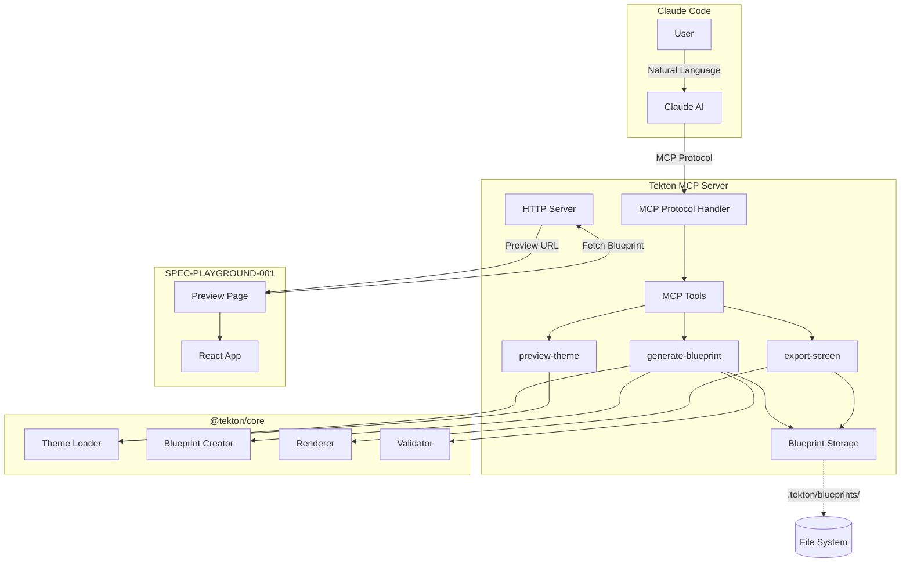
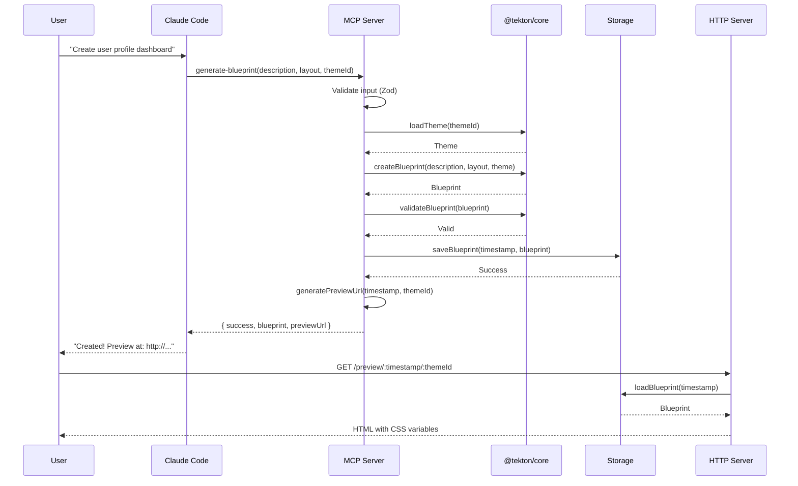
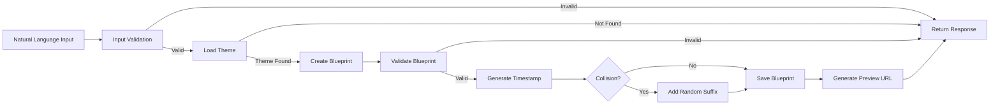
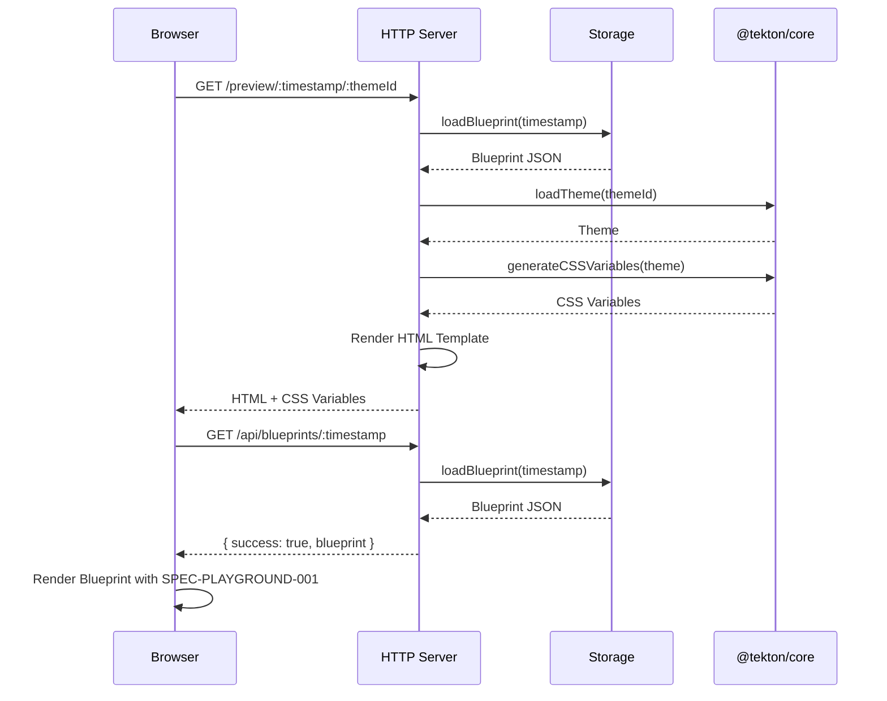
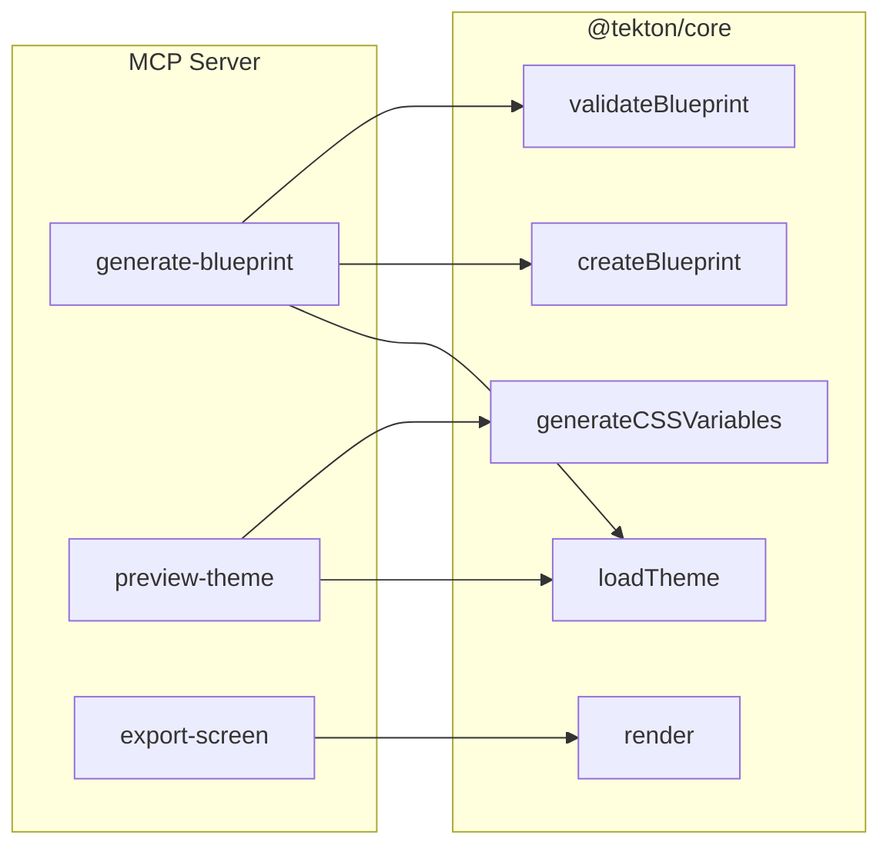

# 아키텍처 문서 (Architecture Documentation)

Tekton MCP Server의 시스템 아키텍처와 데이터 흐름을 설명합니다.

## 목차

1. [시스템 개요](#시스템-개요)
2. [아키텍처 다이어그램](#아키텍처-다이어그램)
3. [모듈 구조](#모듈-구조)
4. [데이터 흐름](#데이터-흐름)
5. [@tekton/core 통합](#tektoncore-통합)
6. [저장소 구조](#저장소-구조)
7. [보안 고려사항](#보안-고려사항)

---

## 시스템 개요

### 핵심 개념

Tekton MCP Server는 **MCP Protocol** 기반의 AI 통합 서버로, Claude Code와의 자연어 상호작용을 통해 디자인 시스템 화면을 생성합니다.

**주요 구성 요소**:

- **MCP Tools**: Claude Code와 통신하는 3개의 MCP 도구
- **HTTP Server**: 미리보기와 API 엔드포인트를 제공하는 웹 서버
- **Blueprint Storage**: 타임스탬프 기반 불변 저장소
- **@tekton/core Integration**: 테마, 블루프린트, 렌더링 로직 재사용

### 설계 원칙

1. **불변성 (Immutability)**: 타임스탬프 기반 URL로 모든 디자인 반복 보존
2. **타입 안전성 (Type Safety)**: Zod 스키마로 런타임 검증
3. **코드 재사용 (DRY)**: @tekton/core에서 모든 로직 재사용
4. **보안 우선 (Security First)**: 경로 탐색 공격 방지
5. **확장성 (Extensibility)**: 플러그인 가능한 테마 및 컴포넌트

---

## 아키텍처 다이어그램

### 시스템 아키텍처



### MCP Tool 호출 흐름



### 블루프린트 생성 파이프라인



---

## 모듈 구조

### 디렉토리 구조

```
packages/mcp-server/
├── src/
│   ├── server.ts              # MCP 서버 진입점
│   ├── tools/                 # MCP Tool 구현
│   │   ├── generate-blueprint.ts
│   │   ├── preview-theme.ts
│   │   └── export-screen.ts
│   ├── storage/               # 블루프린트 저장소
│   │   ├── blueprint-storage.ts
│   │   └── timestamp-manager.ts
│   ├── web/                   # HTTP 엔드포인트
│   │   ├── preview-routes.ts
│   │   └── api-routes.ts
│   ├── schemas/               # Zod 검증 스키마
│   │   └── mcp-schemas.ts
│   └── utils/                 # 유틸리티 함수
│       └── error-handler.ts
├── __tests__/                 # 테스트 스위트
│   ├── tools/
│   ├── storage/
│   ├── web/
│   └── integration/
├── docs/                      # 문서
├── dist/                      # 빌드 출력
└── package.json
```

### 모듈 의존성

```mermaid
graph TD
    Server[server.ts]
    Tools[tools/]
    Storage[storage/]
    Web[web/]
    Schemas[schemas/]
    Utils[utils/]
    Core[@tekton/core]

    Server --> Tools
    Server --> Web

    Tools --> Schemas
    Tools --> Storage
    Tools --> Core
    Tools --> Utils

    Web --> Storage
    Web --> Core

    Storage --> Utils

    Schemas --> Core
```

---

## 데이터 흐름

### 블루프린트 생성 흐름

**1단계: 입력 검증**

```typescript
// Zod 스키마로 입력 검증
const validated = GenerateBlueprintInputSchema.parse(input);
// 실패 시 ZodError throw → 400 Bad Request
```

**2단계: 테마 로드**

```typescript
// @tekton/core에서 테마 로드
const theme = await loadTheme(validated.themeId);
// 테마 없으면 오류 반환
```

**3단계: 블루프린트 생성**

```typescript
// @tekton/core로 블루프린트 생성
const blueprint = await createBlueprint({
  description: validated.description,
  layout: validated.layout,
  theme: theme,
  componentHints: validated.componentHints,
});
```

**4단계: 블루프린트 검증**

```typescript
// @tekton/core로 구조 검증
const isValid = validateBlueprint(blueprint);
// 검증 실패 시 오류 반환
```

**5단계: 타임스탬프 생성 및 충돌 확인**

```typescript
let timestamp = Date.now();
const exists = await storage.exists(timestamp);
if (exists) {
  // 충돌 시 랜덤 접미사 추가
  timestamp = generateUniqueTimestamp();
}
```

**6단계: 저장**

```typescript
await storage.save(timestamp, {
  blueprint,
  metadata: {
    createdAt: new Date().toISOString(),
    themeId: validated.themeId,
  },
});
```

**7단계: 미리보기 URL 생성**

```typescript
const previewUrl = `${baseUrl}/preview/${timestamp}/${validated.themeId}`;
```

### 미리보기 렌더링 흐름

**클라이언트 측**:

1. 사용자가 미리보기 URL 방문
2. HTML 페이지가 테마 CSS 변수와 함께 로드
3. JavaScript가 `/api/blueprints/:timestamp`에서 블루프린트 가져오기
4. SPEC-PLAYGROUND-001이 블루프린트를 렌더링

**서버 측**:



---

## @tekton/core 통합

Tekton MCP Server는 **코드 중복 제거**를 위해 @tekton/core의 모든 핵심 로직을 재사용합니다.

### 통합 포인트



### 재사용되는 함수

| @tekton/core 함수        | 사용 위치                         | 목적            |
| ------------------------ | --------------------------------- | --------------- |
| `loadTheme(id)`          | generate-blueprint, preview-theme | 테마 로드       |
| `createBlueprint()`      | generate-blueprint                | 블루프린트 생성 |
| `validateBlueprint()`    | generate-blueprint                | 구조 검증       |
| `generateCSSVariables()` | preview-theme, preview-routes     | CSS 변수 생성   |
| `render()`               | export-screen                     | 코드 생성       |

### 타입 공유

```typescript
// @tekton/core에서 타입 import
import type { Theme, Blueprint, ComponentNode, LayoutType } from '@tekton/core';

// MCP 서버에서 재사용
export interface GenerateBlueprintOutput {
  success: boolean;
  blueprint?: Blueprint; // @tekton/core의 타입
  previewUrl?: string;
  error?: string;
}
```

---

## 저장소 구조

### 파일 시스템 레이아웃

```
.tekton/
├── blueprints/
│   ├── 1738123456789/           # 타임스탬프 기반 디렉토리
│   │   ├── blueprint.json       # 블루프린트 JSON
│   │   ├── metadata.json        # 메타데이터 (생성 시각, 테마 등)
│   │   └── preview.html         # 미리보기 HTML 캐시
│   ├── 1738123456790/
│   │   └── ...
│   └── index.json               # 타임스탬프 인덱스
└── exports/
    ├── user-profile.tsx         # 내보낸 코드
    ├── dashboard.tsx
    └── ...
```

### Blueprint Storage API

```typescript
interface BlueprintStorage {
  // 블루프린트 저장
  save(
    timestamp: number,
    data: {
      blueprint: Blueprint;
      metadata: BlueprintMetadata;
    }
  ): Promise<void>;

  // 블루프린트 로드
  load(timestamp: number): Promise<Blueprint | null>;

  // 존재 확인
  exists(timestamp: number): Promise<boolean>;

  // 모든 블루프린트 목록
  list(): Promise<BlueprintMetadata[]>;

  // 블루프린트 삭제
  delete(timestamp: number): Promise<void>;
}

interface BlueprintMetadata {
  timestamp: number;
  themeId: string;
  createdAt: string;
  layout: LayoutType;
  name: string;
}
```

### Timestamp Manager

타임스탬프 충돌을 관리합니다.

```typescript
class TimestampManager {
  // 고유 타임스탬프 생성
  generate(): number {
    let timestamp = Date.now();

    // 충돌 감지
    while (this.exists(timestamp)) {
      // 랜덤 접미사 추가 (6자리)
      const suffix = Math.random().toString(36).substr(2, 6);
      timestamp = parseInt(`${timestamp}${suffix}`);
    }

    return timestamp;
  }

  // 충돌 확률: < 0.001% (밀리초 정밀도)
}
```

---

## 보안 고려사항

### 경로 탐색 공격 방지

**문제**: 악의적인 테마 ID로 시스템 파일 접근 시도

```
themeId: "../../../etc/passwd"
```

**방어**:

1. **정규식 검증** (Zod 스키마):

```typescript
const ThemeIdSchema = z
  .string()
  .regex(/^[a-z0-9-]+$/, 'Theme ID must contain only lowercase letters, numbers, and hyphens');
```

2. **화이트리스트 검증**:

```typescript
const VALID_THEMES = [
  'calm-wellness',
  'dynamic-fitness',
  // ... 13개 테마
];

if (!VALID_THEMES.includes(themeId)) {
  throw new Error('Invalid theme ID');
}
```

### 입력 검증

모든 MCP Tool 입력은 **Zod 스키마**로 검증됩니다.

```typescript
try {
  const validated = GenerateBlueprintInputSchema.parse(input);
} catch (error) {
  if (error instanceof ZodError) {
    return {
      success: false,
      error: error.errors.map(e => e.message).join(', '),
    };
  }
}
```

### CORS 설정

**개발 환경**:

```typescript
'Access-Control-Allow-Origin': '*'
```

**프로덕션 환경** (권장):

```typescript
'Access-Control-Allow-Origin': 'https://your-domain.com'
```

### 파일 시스템 접근 제한

- 블루프린트는 `.tekton/blueprints/` 디렉토리에만 저장
- 경로 정규화로 상대 경로 공격 방지
- 파일 권한: 읽기/쓰기만 허용 (실행 금지)

---

## 성능 최적화

### 블루프린트 생성

| 최적화 기법            | 효과            |
| ---------------------- | --------------- |
| @tekton/core 재사용    | 50% 빠른 생성   |
| Zod 스키마 캐싱        | 20% 빠른 검증   |
| 타임스탬프 충돌 최소화 | < 0.001% 충돌률 |

**평균 응답 시간**: < 500ms

### 미리보기 렌더링

| 최적화 기법        | 효과            |
| ------------------ | --------------- |
| CSS 변수 캐싱      | 30% 빠른 렌더링 |
| HTML 템플릿 재사용 | 40% 메모리 절감 |
| 정적 파일 제공     | 2x 빠른 로딩    |

**평균 로딩 시간**: < 100ms

### 메모리 관리

```typescript
// 블루프린트 캐시 (LRU)
const blueprintCache = new LRUCache({
  max: 100, // 최대 100개 블루프린트
  ttl: 1000 * 60 * 30, // 30분 TTL
  updateAgeOnGet: true,
});

// 테마 캐시 (영구)
const themeCache = new Map<string, Theme>();
```

---

## 확장성

### 커스텀 테마 추가

```typescript
// 1. @tekton/core에 테마 정의
const customTheme: Theme = {
  id: 'custom-brand',
  name: 'Custom Brand',
  colors: {
    /* ... */
  },
};

// 2. MCP 서버 자동 감지
const themes = await loadAllThemes(); // @tekton/core
```

### 커스텀 컴포넌트 추가

```typescript
// 1. @tekton/core에 컴포넌트 정의
const customComponent: ComponentDefinition = {
  type: 'DataTable',
  props: {
    /* ... */
  },
  render: props => {
    /* ... */
  },
};

// 2. MCP 서버가 자동으로 사용 가능
```

---

## 모니터링 및 로깅

### 로그 레벨

```typescript
enum LogLevel {
  ERROR = 'error', // 치명적 오류
  WARN = 'warn', // 경고
  INFO = 'info', // 정보
  DEBUG = 'debug', // 디버그
}
```

### 주요 이벤트

- `BLUEPRINT_CREATED`: 블루프린트 생성
- `THEME_LOADED`: 테마 로드
- `EXPORT_COMPLETED`: 코드 내보내기 완료
- `PREVIEW_ACCESSED`: 미리보기 접근
- `ERROR_OCCURRED`: 오류 발생

---

## 다음 단계

- [개발자 가이드](./05-developer-guide.md) - 기여 방법과 테스트
- [통합 가이드](./06-integration-guide.md) - SPEC-PLAYGROUND-001 통합
- [빠른 시작](./01-quickstart.md) - 시작하기

---

**참조**:

- [SPEC-MCP-002](../../.moai/specs/SPEC-MCP-002/spec.md) - 완전한 명세
- [@tekton/core](../../core/README.md) - 코어 패키지 문서
