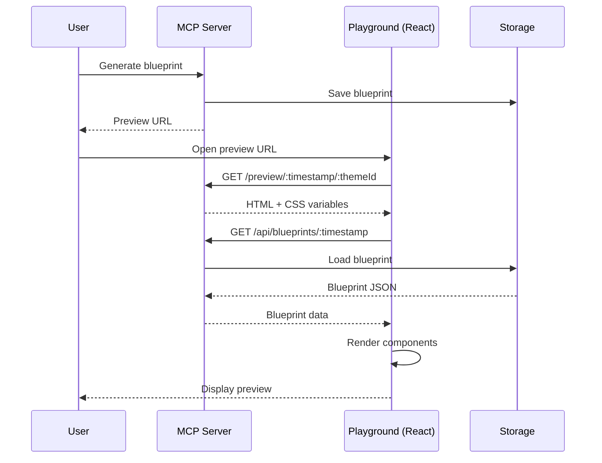

# 통합 가이드 (Integration Guide)

Tekton MCP Server를 다른 시스템과 통합하는 방법을 안내합니다.

## 목차

1. [SPEC-PLAYGROUND-001 통합](#spec-playground-001-통합)
2. [Claude Code 통합](#claude-code-통합)
3. [@tekton/core 통합](#tektoncore-통합)
4. [커스텀 통합](#커스텀-통합)
5. [배포 가이드](#배포-가이드)

---

## SPEC-PLAYGROUND-001 통합

SPEC-PLAYGROUND-001은 Tekton 블루프린트를 렌더링하는 React 기반 플레이그라운드입니다.

### 통합 아키텍처



### 미리보기 페이지 통합

#### 1. HTML 템플릿 구조

MCP 서버가 제공하는 미리보기 페이지:

```html
<!DOCTYPE html>
<html>
  <head>
    <meta charset="utf-8" />
    <meta name="viewport" content="width=device-width, initial-scale=1" />
    <title>Tekton Preview - {themeId}</title>
    <style>
      :root {
        /* 테마 CSS 변수 주입 */
        --color-primary: oklch(0.45 0.15 220);
        --color-secondary: oklch(0.6 0.12 280);
        /* ... */
      }
    </style>
  </head>
  <body>
    <div id="root" data-timestamp="{timestamp}" data-theme-id="{themeId}"></div>

    <script>
      window.__TEKTON_PREVIEW__ = {
        timestamp: { timestamp },
        themeId: '{themeId}',
        blueprintUrl: '/api/blueprints/{timestamp}',
      };
    </script>

    <!-- Playground script -->
    <script src="http://localhost:3001/playground.js"></script>
  </body>
</html>
```

#### 2. Playground 클라이언트 구현

React 플레이그라운드에서 블루프린트를 로드하고 렌더링:

```typescript
// playground/src/PreviewClient.tsx
import { useEffect, useState } from 'react';
import { Blueprint } from '@tekton/core';
import { BlueprintRenderer } from './components/BlueprintRenderer';

export function PreviewClient() {
  const [blueprint, setBlueprint] = useState<Blueprint | null>(null);
  const [loading, setLoading] = useState(true);

  useEffect(() => {
    const config = window.__TEKTON_PREVIEW__;

    if (!config) {
      console.error('Tekton preview config not found');
      return;
    }

    // 블루프린트 로드
    fetch(config.blueprintUrl)
      .then(res => res.json())
      .then(data => {
        if (data.success) {
          setBlueprint(data.blueprint);
        }
      })
      .catch(console.error)
      .finally(() => setLoading(false));
  }, []);

  if (loading) {
    return <div>Loading blueprint...</div>;
  }

  if (!blueprint) {
    return <div>Blueprint not found</div>;
  }

  return <BlueprintRenderer blueprint={blueprint} />;
}
```

#### 3. 테마 전환

URL의 테마 ID를 변경하여 실시간 테마 전환:

```typescript
// playground/src/hooks/useThemeSwitcher.ts
export function useThemeSwitcher() {
  const switchTheme = (newThemeId: string) => {
    const url = new URL(window.location.href);
    const pathParts = url.pathname.split('/');

    // /preview/:timestamp/:themeId
    pathParts[3] = newThemeId;

    const newUrl = pathParts.join('/');
    window.location.href = newUrl;
  };

  return { switchTheme };
}

// 사용 예제
function ThemeSwitcher() {
  const { switchTheme } = useThemeSwitcher();

  return (
    <select onChange={(e) => switchTheme(e.target.value)}>
      <option value="calm-wellness">Calm Wellness</option>
      <option value="dynamic-fitness">Dynamic Fitness</option>
      <option value="korean-fintech">Korean Fintech</option>
      {/* ... */}
    </select>
  );
}
```

### 컴포넌트 매핑

Playground는 블루프린트의 컴포넌트 타입을 실제 React 컴포넌트로 매핑합니다.

```typescript
// playground/src/components/ComponentMapper.tsx
import { ComponentNode } from '@tekton/core';
import * as Components from './primitives';

const COMPONENT_MAP: Record<string, React.ComponentType<any>> = {
  Button: Components.Button,
  Card: Components.Card,
  Text: Components.Text,
  Heading: Components.Heading,
  Avatar: Components.Avatar,
  // ... 20개 컴포넌트
};

export function ComponentMapper({ node }: { node: ComponentNode }) {
  const Component = COMPONENT_MAP[node.type];

  if (!Component) {
    console.warn(`Unknown component type: ${node.type}`);
    return null;
  }

  const children = node.children?.map((child, index) => {
    if (typeof child === 'string') {
      return child;
    }
    return <ComponentMapper key={index} node={child} />;
  });

  return <Component {...node.props}>{children}</Component>;
}
```

### 레이아웃 렌더링

블루프린트의 레이아웃 타입에 따라 적절한 레이아웃 컴포넌트 사용:

```typescript
// playground/src/components/LayoutRenderer.tsx
import { Blueprint } from '@tekton/core';
import { SingleColumnLayout } from './layouts/SingleColumn';
import { TwoColumnLayout } from './layouts/TwoColumn';
import { SidebarLeftLayout } from './layouts/SidebarLeft';
import { DashboardLayout } from './layouts/Dashboard';

const LAYOUT_MAP = {
  'single-column': SingleColumnLayout,
  'two-column': TwoColumnLayout,
  'sidebar-left': SidebarLeftLayout,
  'sidebar-right': SidebarRightLayout,
  'dashboard': DashboardLayout,
  'landing': LandingLayout,
};

export function LayoutRenderer({ blueprint }: { blueprint: Blueprint }) {
  const LayoutComponent = LAYOUT_MAP[blueprint.layout];

  if (!LayoutComponent) {
    console.error(`Unknown layout: ${blueprint.layout}`);
    return null;
  }

  return <LayoutComponent blueprint={blueprint} />;
}
```

---

## Claude Code 통합

### MCP Protocol 설정

Claude Code에서 Tekton MCP Server를 사용하려면 MCP 설정이 필요합니다.

#### 1. MCP 서버 등록

`~/.claude/mcp.json` 파일에 Tekton MCP Server 추가:

```json
{
  "servers": {
    "tekton-mcp": {
      "command": "node",
      "args": ["/path/to/tekton/packages/mcp-server/dist/server.js"],
      "env": {
        "PORT": "3000",
        "BASE_URL": "http://localhost:3000"
      }
    }
  }
}
```

#### 2. 서버 시작 확인

```bash
# MCP 서버가 자동으로 시작되는지 확인
curl http://localhost:3000/tools

# 응답 예상:
# {
#   "tools": [
#     { "name": "generate-blueprint", ... },
#     { "name": "preview-theme", ... },
#     { "name": "export-screen", ... }
#   ]
# }
```

### Claude Code에서 Tool 사용

#### 자연어 명령

Claude Code에서 자연어로 Tool 호출:

```
Claude Code에서 입력:

"Use generate-blueprint tool to create a user dashboard with these specs:
- Layout: sidebar-left
- Theme: korean-fintech
- Components: Profile card with avatar, stats cards, activity table
- Make it professional and clean"
```

Claude가 자동으로 MCP Tool을 호출하고 결과를 반환합니다.

#### 구조화된 명령

더 정확한 제어를 위한 구조화된 명령:

```json
{
  "tool": "generate-blueprint",
  "input": {
    "description": "Professional user dashboard with profile section, statistics cards, and recent activity table",
    "layout": "sidebar-left",
    "themeId": "korean-fintech",
    "componentHints": ["Card", "Avatar", "Heading", "Table", "Badge"]
  }
}
```

### 워크플로우 자동화

Claude Code에서 여러 Tool을 순차적으로 사용:

```
Claude Code 프롬프트:

"Create a complete dashboard workflow:
1. Preview the korean-fintech theme
2. Generate a dashboard with sales metrics
3. Export the code to src/screens/Dashboard.tsx
4. Show me the preview URL"
```

Claude가 자동으로:

1. `preview-theme` 호출
2. `generate-blueprint` 호출
3. `export-screen` 호출
4. 모든 결과 요약 제공

---

## @tekton/core 통합

MCP 서버는 @tekton/core의 모든 핵심 기능을 재사용합니다.

### 통합 패턴

#### 1. 테마 로드

```typescript
// MCP Server: tools/generate-blueprint.ts
import { loadTheme } from '@tekton/core';

async function generateBlueprintTool(input: GenerateBlueprintInput) {
  // @tekton/core에서 테마 로드
  const theme = await loadTheme(input.themeId);

  if (!theme) {
    return {
      success: false,
      error: `Theme '${input.themeId}' not found`,
    };
  }

  // 테마 사용...
}
```

#### 2. 블루프린트 생성

```typescript
import { createBlueprint, validateBlueprint } from '@tekton/core';

async function generateBlueprintTool(input: GenerateBlueprintInput) {
  const theme = await loadTheme(input.themeId);

  // @tekton/core로 블루프린트 생성
  const blueprint = await createBlueprint({
    description: input.description,
    layout: input.layout,
    theme,
    componentHints: input.componentHints,
  });

  // @tekton/core로 검증
  const validation = validateBlueprint(blueprint);

  if (!validation.valid) {
    return {
      success: false,
      error: validation.errors.join(', '),
    };
  }

  return {
    success: true,
    blueprint,
    previewUrl: generatePreviewUrl(blueprint),
  };
}
```

#### 3. 코드 렌더링

```typescript
import { render } from '@tekton/core';

async function exportScreenTool(input: ExportScreenInput) {
  const blueprint = await storage.load(input.blueprintId);

  // @tekton/core로 코드 생성
  const code = render(blueprint, {
    format: input.format, // 'jsx', 'tsx', 'vue'
    includeTypes: input.format === 'tsx',
    importPath: '@/components',
  });

  return {
    success: true,
    code,
    filePath: input.outputPath || `.tekton/exports/${blueprint.name}.${input.format}`,
  };
}
```

### 타입 공유

@tekton/core의 타입을 MCP 서버에서 재사용:

```typescript
// MCP Server: schemas/mcp-schemas.ts
import type { Blueprint, Theme, ComponentNode, LayoutType } from '@tekton/core';

// Zod 스키마는 런타임 검증용
export const GenerateBlueprintOutputSchema = z.object({
  success: z.boolean(),
  blueprint: z.optional(z.any()), // Blueprint 타입과 호환
  previewUrl: z.string().optional(),
  error: z.string().optional(),
});

// TypeScript 타입은 @tekton/core에서 가져오기
export type GenerateBlueprintOutput = {
  success: boolean;
  blueprint?: Blueprint; // @tekton/core의 타입
  previewUrl?: string;
  error?: string;
};
```

---

## 커스텀 통합

### REST API 클라이언트

HTTP 엔드포인트를 직접 호출하는 커스텀 클라이언트:

```typescript
// custom-client.ts
class TektonClient {
  constructor(private baseUrl: string = 'http://localhost:3000') {}

  async generateBlueprint(params: { description: string; layout: string; themeId: string }) {
    const response = await fetch(`${this.baseUrl}/tools/generate-blueprint`, {
      method: 'POST',
      headers: { 'Content-Type': 'application/json' },
      body: JSON.stringify(params),
    });

    return response.json();
  }

  async previewTheme(themeId: string) {
    const response = await fetch(`${this.baseUrl}/tools/preview-theme`, {
      method: 'POST',
      headers: { 'Content-Type': 'application/json' },
      body: JSON.stringify({ themeId }),
    });

    return response.json();
  }

  async exportScreen(blueprintId: string, format: 'jsx' | 'tsx' | 'vue') {
    const response = await fetch(`${this.baseUrl}/tools/export-screen`, {
      method: 'POST',
      headers: { 'Content-Type': 'application/json' },
      body: JSON.stringify({ blueprintId, format }),
    });

    return response.json();
  }

  async getBlueprint(timestamp: number) {
    const response = await fetch(`${this.baseUrl}/api/blueprints/${timestamp}`);
    return response.json();
  }

  async listThemes() {
    const response = await fetch(`${this.baseUrl}/api/themes`);
    return response.json();
  }
}

// 사용 예제
const client = new TektonClient();

const result = await client.generateBlueprint({
  description: 'User profile dashboard',
  layout: 'sidebar-left',
  themeId: 'calm-wellness',
});

console.log('Preview URL:', result.previewUrl);
```

### CI/CD 통합

GitHub Actions에서 Tekton MCP Server 사용:

```yaml
# .github/workflows/generate-screens.yml
name: Generate Design Screens

on:
  push:
    paths:
      - 'design-specs/**'

jobs:
  generate:
    runs-on: ubuntu-latest

    steps:
      - uses: actions/checkout@v4

      - name: Setup Node.js
        uses: actions/setup-node@v4
        with:
          node-version: '20'

      - name: Install dependencies
        run: |
          npm install -g pnpm
          pnpm install

      - name: Start MCP Server
        run: |
          cd packages/mcp-server
          pnpm build
          pnpm start &
          sleep 5  # 서버 시작 대기

      - name: Generate Blueprints
        run: |
          node scripts/generate-from-specs.js

      - name: Export Code
        run: |
          node scripts/export-screens.js

      - name: Commit Generated Files
        run: |
          git config user.name "GitHub Actions"
          git config user.email "actions@github.com"
          git add src/screens/
          git commit -m "chore: generate screens from design specs"
          git push
```

### 웹훅 통합

외부 시스템에서 웹훅으로 블루프린트 생성 트리거:

```typescript
// webhook-handler.ts
import express from 'express';
import { TektonClient } from './custom-client';

const app = express();
app.use(express.json());

const tekton = new TektonClient();

app.post('/webhook/figma-design-updated', async (req, res) => {
  const { designName, layout, theme } = req.body;

  try {
    // Figma 디자인 업데이트 시 자동으로 블루프린트 생성
    const result = await tekton.generateBlueprint({
      description: `Figma design: ${designName}`,
      layout,
      themeId: theme,
    });

    // Slack 알림
    await notifySlack({
      message: `New blueprint generated: ${result.previewUrl}`,
    });

    res.json({ success: true, previewUrl: result.previewUrl });
  } catch (error) {
    res.status(500).json({ success: false, error: error.message });
  }
});

app.listen(4000, () => {
  console.log('Webhook handler listening on port 4000');
});
```

---

## 배포 가이드

### 개발 환경

```bash
# 개발 서버 실행
pnpm dev

# 환경 변수 설정
export PORT=3000
export BASE_URL=http://localhost:3000
export NODE_ENV=development
```

### 프로덕션 환경

#### Docker 배포

```dockerfile
# Dockerfile
FROM node:20-alpine

WORKDIR /app

# 의존성 설치
COPY package.json pnpm-lock.yaml ./
RUN npm install -g pnpm && pnpm install --frozen-lockfile

# 소스 복사 및 빌드
COPY . .
RUN pnpm build

# 프로덕션 환경 변수
ENV PORT=3000
ENV BASE_URL=http://localhost:3000
ENV NODE_ENV=production

EXPOSE 3000

CMD ["pnpm", "start"]
```

```bash
# Docker 빌드 및 실행
docker build -t tekton-mcp-server .
docker run -p 3000:3000 tekton-mcp-server
```

#### Kubernetes 배포

```yaml
# k8s/deployment.yaml
apiVersion: apps/v1
kind: Deployment
metadata:
  name: tekton-mcp-server
spec:
  replicas: 3
  selector:
    matchLabels:
      app: tekton-mcp-server
  template:
    metadata:
      labels:
        app: tekton-mcp-server
    spec:
      containers:
        - name: mcp-server
          image: tekton-mcp-server:latest
          ports:
            - containerPort: 3000
          env:
            - name: PORT
              value: '3000'
            - name: BASE_URL
              value: 'https://tekton.yourdomain.com'
            - name: NODE_ENV
              value: 'production'
          resources:
            requests:
              memory: '256Mi'
              cpu: '250m'
            limits:
              memory: '512Mi'
              cpu: '500m'
---
apiVersion: v1
kind: Service
metadata:
  name: tekton-mcp-server
spec:
  type: LoadBalancer
  ports:
    - port: 80
      targetPort: 3000
  selector:
    app: tekton-mcp-server
```

#### 환경 변수 설정

```bash
# .env.production
PORT=3000
BASE_URL=https://tekton.yourdomain.com
NODE_ENV=production
LOG_LEVEL=info
CORS_ORIGIN=https://playground.yourdomain.com
```

### 모니터링

#### 헬스체크 엔드포인트

```typescript
// src/web/health-routes.ts
app.get('/health', (req, res) => {
  res.json({
    status: 'healthy',
    version: '0.1.0',
    uptime: process.uptime(),
    timestamp: Date.now(),
  });
});

app.get('/ready', async (req, res) => {
  try {
    // 저장소 접근 가능 확인
    await storage.healthCheck();

    // @tekton/core 로드 가능 확인
    await loadTheme('calm-wellness');

    res.json({ ready: true });
  } catch (error) {
    res.status(503).json({ ready: false, error: error.message });
  }
});
```

#### Prometheus 메트릭

```typescript
// src/utils/metrics.ts
import promClient from 'prom-client';

const register = new promClient.Registry();

const blueprintGenerations = new promClient.Counter({
  name: 'tekton_blueprint_generations_total',
  help: 'Total number of blueprint generations',
  registers: [register],
});

const generationDuration = new promClient.Histogram({
  name: 'tekton_blueprint_generation_duration_seconds',
  help: 'Duration of blueprint generation',
  registers: [register],
});

export { register, blueprintGenerations, generationDuration };
```

---

## 문제 해결

### CORS 오류

**문제**: Playground에서 MCP 서버에 접근 시 CORS 오류

**해결**:

```typescript
// src/server.ts
const ALLOWED_ORIGINS = [
  'http://localhost:3001', // 개발
  'https://playground.yourdomain.com', // 프로덕션
];

app.use((req, res, next) => {
  const origin = req.headers.origin;
  if (ALLOWED_ORIGINS.includes(origin)) {
    res.setHeader('Access-Control-Allow-Origin', origin);
  }
  next();
});
```

### 타임스탬프 충돌

**문제**: 동시에 여러 블루프린트 생성 시 충돌

**해결**: Timestamp Manager가 자동으로 처리하지만, 필요시 수동 재시도:

```typescript
let retries = 0;
const MAX_RETRIES = 3;

while (retries < MAX_RETRIES) {
  const timestamp = generateTimestamp();
  const exists = await storage.exists(timestamp);

  if (!exists) {
    break;
  }

  retries++;
  await sleep(10); // 10ms 대기
}
```

---

## 추가 리소스

- [SPEC-PLAYGROUND-001](../../.moai/specs/SPEC-PLAYGROUND-001/spec.md) - Playground 명세
- [@tekton/core 문서](../../core/README.md) - 코어 패키지
- [MCP Protocol](https://modelcontextprotocol.io/) - MCP 프로토콜 문서

---

**이전**: [개발자 가이드](./05-developer-guide.md) - 개발 및 기여 방법
