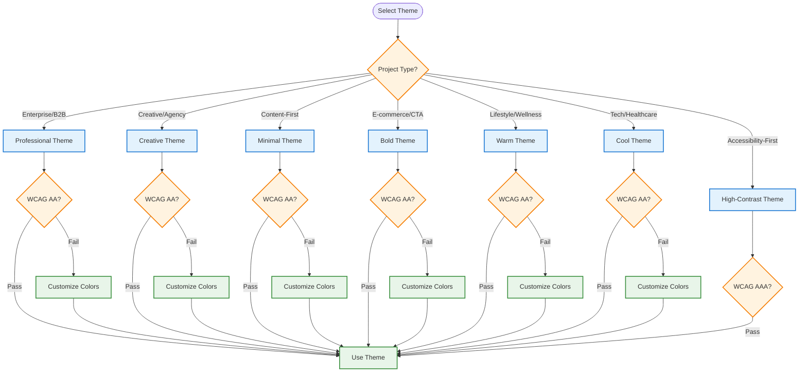

# Best Practices

Recommended patterns and decision trees for effective usage of the Token Contract & CSS Variable System.

---

## Design Token Selection

### Choosing the Right Theme

Use this decision tree to select the most appropriate theme for your project:



### Theme Characteristics Matrix

| Theme | Use Case | Primary Hue | Contrast Level | Best For |
|--------|----------|-------------|----------------|----------|
| **Professional** | Enterprise, SaaS, Dashboards | 220° (Blue) | High | Trust, reliability, corporate |
| **Creative** | Agencies, Portfolios, Marketing | 270° (Purple) | Medium-High | Bold, expressive, innovative |
| **Minimal** | Blogs, Documentation, Content | Neutral Gray | Medium | Focus, readability, simplicity |
| **Bold** | E-commerce, Call-to-Action | 0° (Red) | Very High | Conversion, urgency, energy |
| **Warm** | Lifestyle, Food, Wellness | 25° (Orange) | Medium | Friendly, inviting, comfortable |
| **Cool** | Tech, Fintech, Healthcare | 210° (Cyan-Blue) | Medium-High | Modern, clean, professional |
| **High-Contrast** | Accessibility, Government, Education | Black/White | Maximum (AAA) | Accessibility, clarity |

---

## Token Usage Patterns

### Semantic Tokens vs. Color Scales

**Prefer Semantic Tokens**:
```css
/* ✅ Good: Semantic token usage */
.button {
  background-color: var(--tekton-button-default);
  color: var(--tekton-text-on-primary);
}
```

**Avoid Direct Color Scale References**:
```css
/* ❌ Avoid: Direct color scale reference */
.button {
  background-color: var(--tekton-primary-500);
  color: var(--tekton-neutral-50);
}
```

**Why**: Semantic tokens adapt to context and theme changes, while color scales are fixed values.

**Exception**: Use color scales when creating custom component variants where semantic tokens don't apply.

---

### State Token Patterns

**Interactive Components**:
```css
/* ✅ Good: State token pattern */
.button {
  background-color: var(--tekton-button-default);
}

.button:hover {
  background-color: var(--tekton-button-hover);
}

.button:active {
  background-color: var(--tekton-button-active);
}

.button:focus-visible {
  outline: 2px solid var(--tekton-button-focus);
  outline-offset: 2px;
}

.button:disabled {
  background-color: var(--tekton-button-disabled);
  cursor: not-allowed;
}
```

**React Implementation**:
```tsx
import { useButton } from '@tekton/hooks';

function Button({ children, disabled, ...props }) {
  const { getRootProps, isHovered, isPressed, isFocused } = useButton({ disabled, ...props });

  const getBackgroundColor = () => {
    if (disabled) return 'var(--tekton-button-disabled)';
    if (isPressed) return 'var(--tekton-button-active)';
    if (isHovered) return 'var(--tekton-button-hover)';
    if (isFocused) return 'var(--tekton-button-focus)';
    return 'var(--tekton-button-default)';
  };

  return (
    <button
      {...getRootProps()}
      style={{
        backgroundColor: getBackgroundColor(),
        color: 'var(--tekton-text-on-primary)',
      }}
    >
      {children}
    </button>
  );
}
```

---

### Composition Token Patterns

**Consistent Design System**:
```css
/* ✅ Good: Composition token usage */
.card {
  border: var(--tekton-border-width) solid var(--tekton-border-default);
  border-radius: var(--tekton-border-radius);
  padding: var(--tekton-spacing-lg);
  box-shadow: var(--tekton-shadow-md);
}

.card-header {
  font-size: var(--tekton-font-size-lg);
  font-weight: var(--tekton-font-weight-bold);
  margin-bottom: var(--tekton-spacing-md);
}
```

**Avoid Hardcoded Values**:
```css
/* ❌ Avoid: Hardcoded values */
.card {
  border: 1px solid #e5e7eb;
  border-radius: 8px;
  padding: 1.5rem;
  box-shadow: 0 4px 6px rgba(0, 0, 0, 0.1);
}
```

**Why**: Composition tokens ensure consistency across the design system and adapt to theme changes.

---

## Performance Optimization

### CSS Variable Caching

**Cache Generated CSS**:
```typescript
import { loadPreset, generateCSSFromTokens } from '@tekton/token-contract';

// ✅ Good: Cache CSS generation
const cssCache = new Map<string, string>();

function getCachedCSS(presetName: string): string {
  if (cssCache.has(presetName)) {
    return cssCache.get(presetName)!;
  }

  const theme = loadPreset(presetName);
  const css = generateCSSFromTokens({
    semantic: theme.tokens,
    composition: theme.composition,
  });

  cssCache.set(presetName, css);
  return css;
}
```

**Avoid Repeated Generation**:
```typescript
// ❌ Avoid: Generating CSS on every render
function MyComponent() {
  const theme = loadPreset('professional');
  const css = generateCSSFromTokens({ semantic: theme.tokens, composition: theme.composition });
  // This regenerates CSS on every render!
}
```

---

### React Performance Patterns

**Memoize Token Derivation**:
```tsx
import { useMemo } from 'react';
import { useTheme } from '@tekton/token-contract';

function MyComponent() {
  const { theme, tokens, darkMode } = useTheme();

  // ✅ Good: Memoize derived values
  const buttonColor = useMemo(() => {
    return darkMode
      ? tokens.primary['600']
      : tokens.primary['500'];
  }, [darkMode, tokens]);

  return <button style={{ backgroundColor: `oklch(${buttonColor.l} ${buttonColor.c} ${buttonColor.h})` }}>Click</button>;
}
```

**Avoid Inline Token Access**:
```tsx
// ❌ Avoid: Inline token access in render
function MyComponent() {
  const { tokens, darkMode } = useTheme();

  return (
    <button
      style={{
        backgroundColor: darkMode
          ? `oklch(${tokens.primary['600'].l} ${tokens.primary['600'].c} ${tokens.primary['600'].h})`
          : `oklch(${tokens.primary['500'].l} ${tokens.primary['500'].c} ${tokens.primary['500'].h})`
      }}
    >
      Click
    </button>
  );
}
```

---

### Minimize Re-renders

**Use CSS Variables for Dynamic Updates**:
```tsx
// ✅ Good: CSS variables prevent re-renders
function DynamicButton({ children }) {
  return (
    <button
      style={{
        backgroundColor: 'var(--tekton-button-default)',
        color: 'var(--tekton-text-on-primary)',
      }}
    >
      {children}
    </button>
  );
}

// Theme change updates CSS variables without re-rendering components
```

**Avoid Direct Token References in Styles**:
```tsx
// ❌ Avoid: Direct token references force re-renders
function DynamicButton({ children }) {
  const { tokens } = useTheme();

  return (
    <button
      style={{
        backgroundColor: `oklch(${tokens.primary['500'].l} ${tokens.primary['500'].c} ${tokens.primary['500'].h})`,
        color: `oklch(${tokens.neutral['50'].l} ${tokens.neutral['50'].c} ${tokens.neutral['50'].h})`,
      }}
    >
      {children}
    </button>
  );
}
```

---

## Accessibility Best Practices

### WCAG Compliance Validation

**Always Validate Contrast**:
```typescript
import { validateWCAGCompliance, loadPreset } from '@tekton/token-contract';

// ✅ Good: Validate compliance before deployment
const theme = loadPreset('professional');
const compliance = validateWCAGCompliance(theme.tokens);

if (!compliance.passed) {
  console.error('WCAG violations detected:', compliance.violations);
  // Fix violations or choose different theme
}
```

**Monitor Custom Overrides**:
```typescript
import { overridePresetTokens, validateWCAGCompliance } from '@tekton/token-contract';

// ✅ Good: Validate custom overrides
const customTokens = overridePresetTokens(baseTokens, {
  primary: { '500': { l: 0.65, c: 0.15, h: 200 } },
});

const compliance = validateWCAGCompliance(customTokens);
if (!compliance.passed) {
  console.warn('Custom colors may not meet WCAG standards');
}
```

---

### High-Contrast Mode Support

**Provide High-Contrast Alternative**:
```tsx
import { useTheme } from '@tekton/token-contract';

function App() {
  const { theme, setPreset } = useTheme();
  const [highContrastMode, setHighContrastMode] = useState(false);

  useEffect(() => {
    if (highContrastMode) {
      setPreset('high-contrast');
    } else {
      setPreset('professional'); // Restore default theme
    }
  }, [highContrastMode, setPreset]);

  return (
    <div>
      <button onClick={() => setHighContrastMode(!highContrastMode)}>
        {highContrastMode ? 'Normal Contrast' : 'High Contrast'}
      </button>
      <YourApp />
    </div>
  );
}
```

---

### Semantic Color Usage

**Use Semantic Names Over Colors**:
```tsx
// ✅ Good: Semantic naming
<button className="success-button">Save</button>
<span className="error-text">Invalid input</span>
<div className="warning-banner">Warning message</div>
```

**Avoid Color-Based Names**:
```tsx
// ❌ Avoid: Color-based naming
<button className="green-button">Save</button>
<span className="red-text">Invalid input</span>
<div className="yellow-banner">Warning message</div>
```

**Why**: Semantic names remain meaningful to screen readers and when colors change.

---

## Dark Mode Best Practices

### Automatic System Detection

**Enable System Theme Detection**:
```tsx
import { ThemeProvider } from '@tekton/token-contract';

function App() {
  return (
    <ThemeProvider defaultPreset="professional" detectSystemTheme={true}>
      <YourApp />
    </ThemeProvider>
  );
}
```

**Respect User Preference**:
```tsx
import { useTheme } from '@tekton/token-contract';

function ThemeToggle() {
  const { darkMode, toggleDarkMode } = useTheme();

  return (
    <button onClick={toggleDarkMode} aria-label="Toggle dark mode">
      {darkMode ? '☀️ Light Mode' : '🌙 Dark Mode'}
    </button>
  );
}
```

---

### Persistent Theme Storage

**Save User Preference**:
```tsx
import { useEffect } from 'react';
import { useTheme } from '@tekton/token-contract';

function App() {
  const { darkMode, theme, setPreset } = useTheme();

  // Save to localStorage
  useEffect(() => {
    localStorage.setItem('theme-dark-mode', JSON.stringify(darkMode));
    localStorage.setItem('theme-theme', theme);
  }, [darkMode, theme]);

  // Restore on mount
  useEffect(() => {
    const savedDarkMode = localStorage.getItem('theme-dark-mode');
    const savedPreset = localStorage.getItem('theme-theme');

    if (savedDarkMode !== null) {
      // Toggle if saved preference differs from default
    }
    if (savedPreset) {
      setPreset(savedPreset as PresetName);
    }
  }, []);

  return <YourApp />;
}
```

---

## Custom Theme Creation

### Extending Base Themes

**Create Brand-Specific Theme**:
```typescript
import { loadPreset, overridePresetTokens } from '@tekton/token-contract';

// ✅ Good: Extend existing theme with brand colors
const basePreset = loadPreset('professional');

const brandPreset = overridePresetTokens(basePreset.tokens, {
  primary: {
    '500': { l: 0.65, c: 0.15, h: 200 }, // Brand blue
  },
  accent: {
    '500': { l: 0.60, c: 0.12, h: 30 }, // Brand orange
  },
});
```

**Validate Custom Theme**:
```typescript
import { validateOverride, validateWCAGCompliance } from '@tekton/token-contract';

// ✅ Good: Validate before using
const overrides = {
  primary: { '500': { l: 0.65, c: 0.15, h: 200 } },
};

const schemaResult = validateOverride(overrides);
if (!schemaResult.valid) {
  console.error('Invalid override:', schemaResult.errors);
}

const wcagResult = validateWCAGCompliance(brandPreset);
if (!wcagResult.passed) {
  console.warn('WCAG violations:', wcagResult.violations);
}
```

---

## Testing Best Practices

### Component Testing with Themes

**Mock ThemeProvider in Tests**:
```tsx
import { render } from '@testing-library/react';
import { ThemeProvider } from '@tekton/token-contract';
import { MyComponent } from './MyComponent';

describe('MyComponent', () => {
  it('renders with default theme', () => {
    render(
      <ThemeProvider defaultPreset="professional">
        <MyComponent />
      </ThemeProvider>
    );
    // Test assertions
  });

  it('renders with dark mode', () => {
    render(
      <ThemeProvider defaultPreset="professional" defaultDarkMode={true}>
        <MyComponent />
      </ThemeProvider>
    );
    // Test assertions
  });
});
```

---

### Visual Regression Testing

**Test All Themes**:
```typescript
import { getAvailablePresets } from '@tekton/token-contract';

const themes = getAvailablePresets();

describe('Visual Regression Tests', () => {
  themes.forEach(theme => {
    it(`renders correctly with ${theme.name} theme`, () => {
      // Snapshot test with each theme
    });
  });
});
```

---

## Error Handling

### Graceful Fallback

**Handle Missing Tokens**:
```typescript
import { getTokenWithFallback } from '@tekton/token-contract';

// ✅ Good: Graceful fallback for missing tokens
const accentColor = getTokenWithFallback(tokens, 'accent', '500', {
  l: 0.6,
  c: 0.12,
  h: 30,
});
```

**Validate Before Using**:
```typescript
import { validateOverride } from '@tekton/token-contract';

// ✅ Good: Validate custom overrides
const result = validateOverride(customOverrides);

if (!result.valid) {
  console.error('Invalid overrides:', result.errors);
  // Use base theme instead
}
```

---

## Documentation Best Practices

### Document Custom Themes

**Create Theme Documentation**:
```markdown
# Brand Theme

Custom theme based on Professional with brand colors.

- Primary: Brand Blue (200°)
- Accent: Brand Orange (30°)
- WCAG: AA Compliant

## Usage

import { loadPreset, overridePresetTokens } from '@tekton/token-contract';

const brandPreset = overridePresetTokens(
  loadPreset('professional').tokens,
  {
    primary: { '500': { l: 0.65, c: 0.15, h: 200 } },
  }
);
```

---

### Component Documentation

**Document Token Usage**:
```tsx
/**
 * Primary Button Component
 *
 * Uses Token Contract state tokens:
 * - default: var(--tekton-button-default)
 * - hover: var(--tekton-button-hover)
 * - active: var(--tekton-button-active)
 * - focus: var(--tekton-button-focus)
 * - disabled: var(--tekton-button-disabled)
 */
export function PrimaryButton({ children, ...props }) {
  // Implementation
}
```

---

## Common Anti-Patterns

### Avoid These Patterns

**1. Hardcoded OKLCH Values**:
```css
/* ❌ Avoid */
.button {
  background-color: oklch(0.6 0.15 220);
}

/* ✅ Use CSS variables instead */
.button {
  background-color: var(--tekton-button-default);
}
```

**2. Bypassing WCAG Validation**:
```typescript
// ❌ Avoid: Ignoring WCAG validation
const customTokens = overridePresetTokens(base, overrides);
// Use without validation

// ✅ Always validate
const compliance = validateWCAGCompliance(customTokens);
if (!compliance.passed) {
  console.warn('WCAG violations detected');
}
```

**3. Theme-Dependent Logic**:
```tsx
// ❌ Avoid: Theme-dependent conditional logic
function MyComponent() {
  const { theme } = useTheme();

  if (theme === 'professional') {
    return <ProfessionalLayout />;
  } else {
    return <DefaultLayout />;
  }
}

// ✅ Use CSS variables for styling, not logic
function MyComponent() {
  return (
    <div style={{ backgroundColor: 'var(--tekton-neutral-50)' }}>
      <DefaultLayout />
    </div>
  );
}
```

---

## Summary Checklist

### Before Deployment
- [ ] Validate WCAG compliance for all color tokens
- [ ] Test all themes in light and dark modes
- [ ] Verify CSS variable naming conventions
- [ ] Test dark mode toggle functionality
- [ ] Validate custom overrides (if any)
- [ ] Test component rendering across themes
- [ ] Check browser compatibility (Chrome 111+, Firefox 113+, Safari 15.4+)
- [ ] Review performance metrics (≤3 re-renders per theme change)

### During Development
- [ ] Use semantic tokens over color scales
- [ ] Apply state tokens for interactive components
- [ ] Use composition tokens for consistency
- [ ] Cache generated CSS
- [ ] Minimize re-renders with CSS variables
- [ ] Document custom themes

### Post-Deployment
- [ ] Monitor WCAG compliance
- [ ] Collect user feedback on themes
- [ ] Track theme switch performance
- [ ] Update documentation for custom tokens

---

**Last Updated**: 2026-01-17
**Version**: 1.0.0
**Status**: Production Ready
